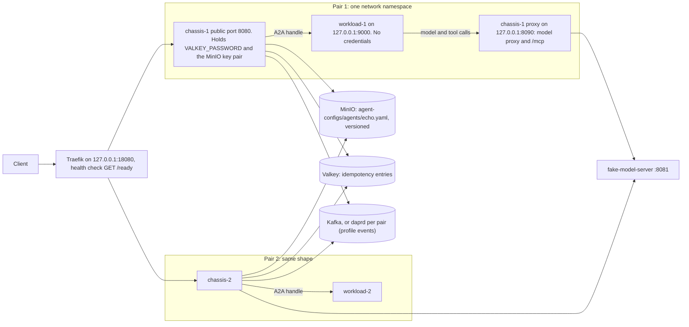
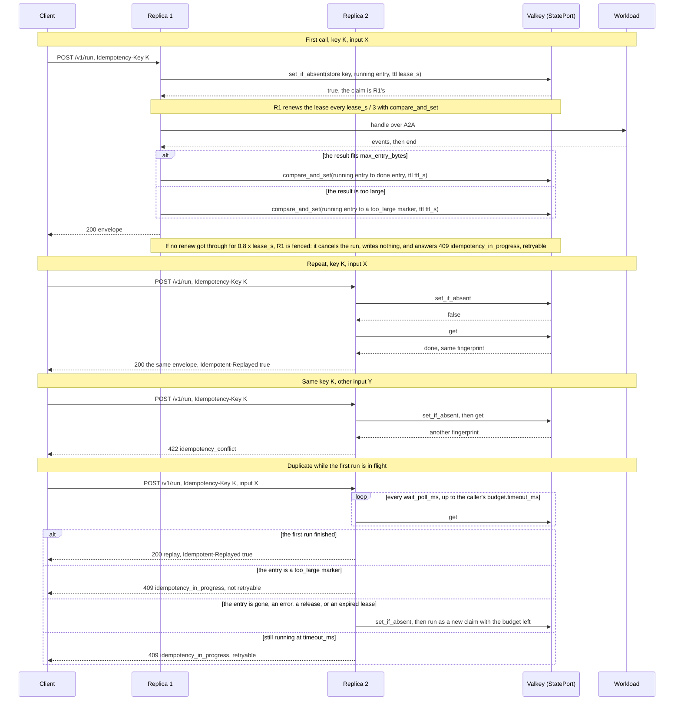
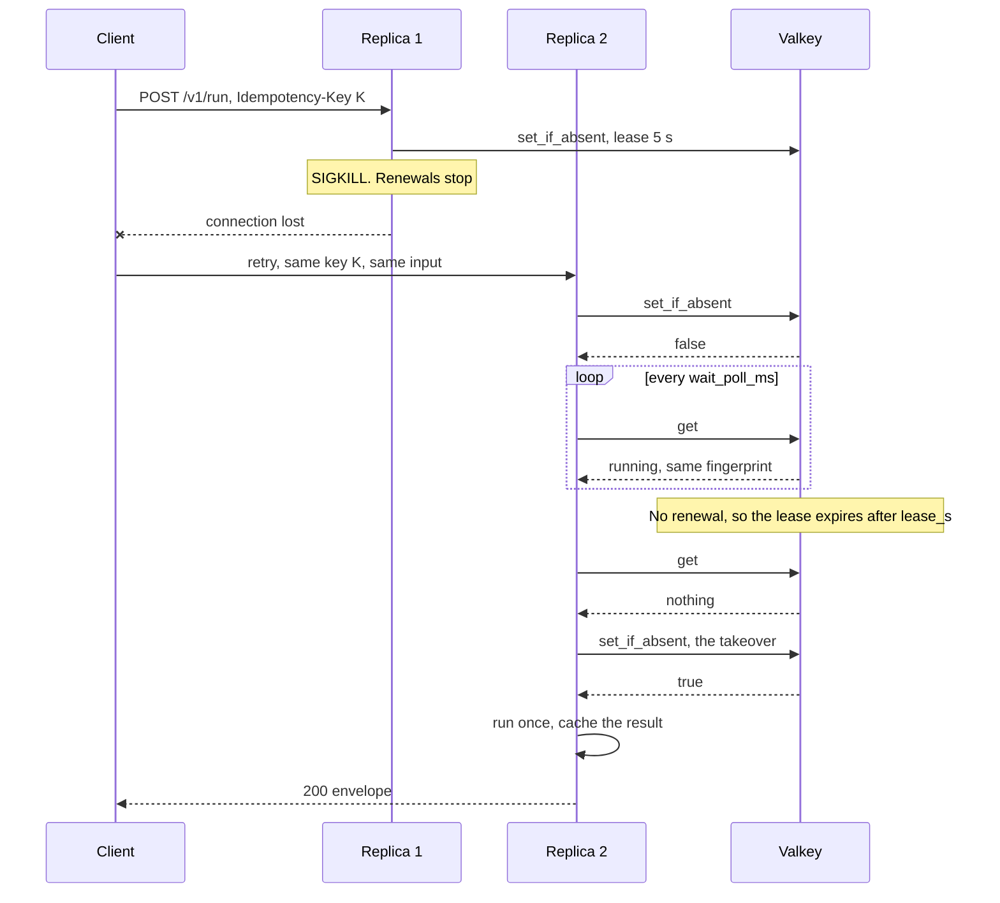
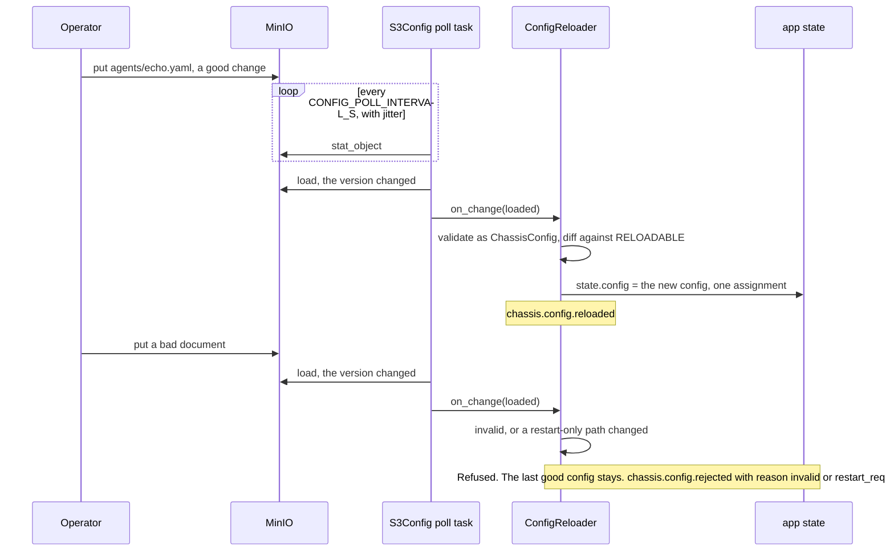
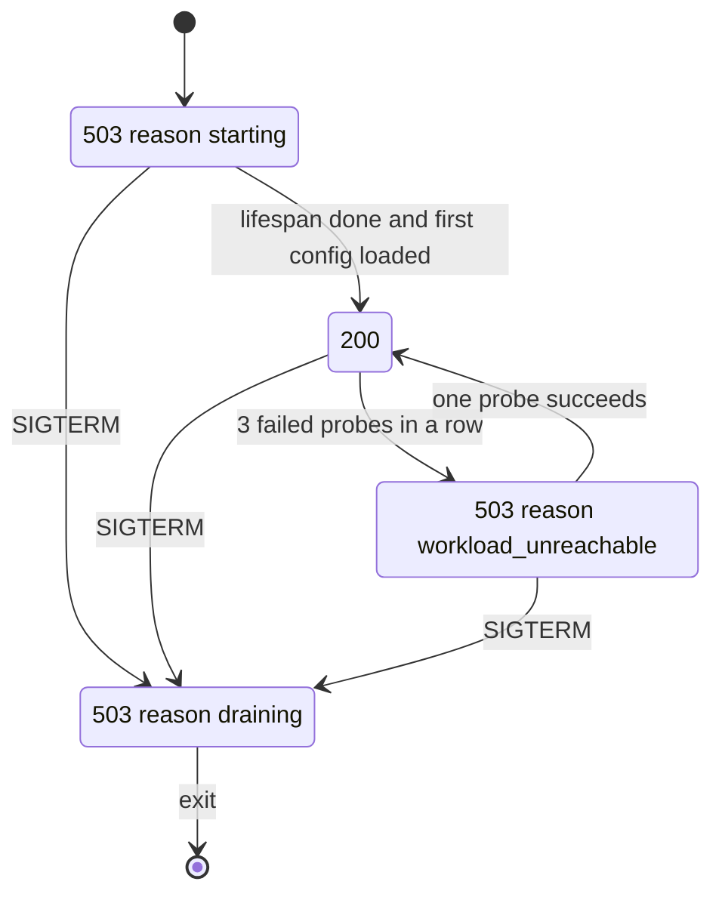
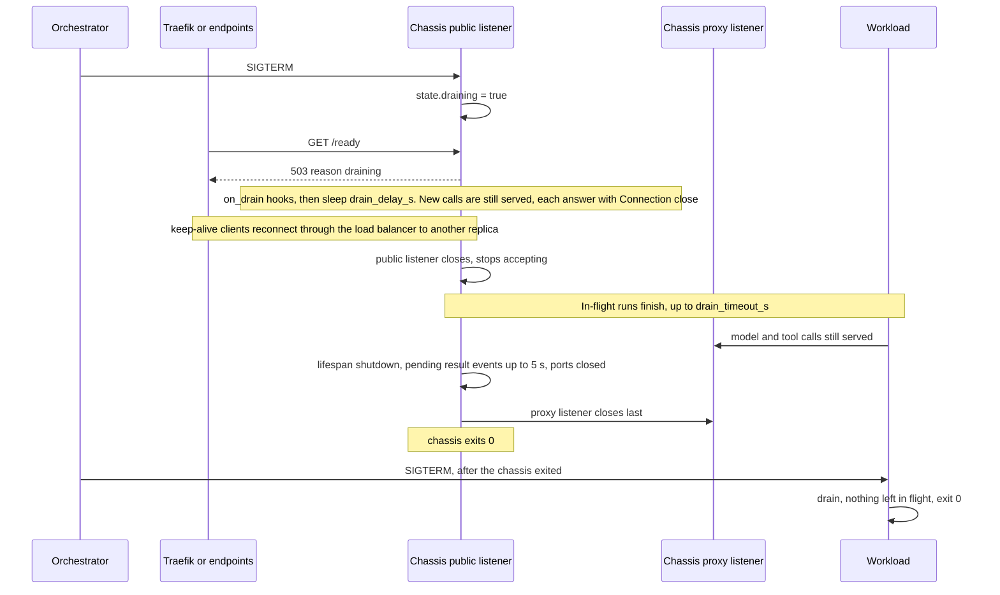
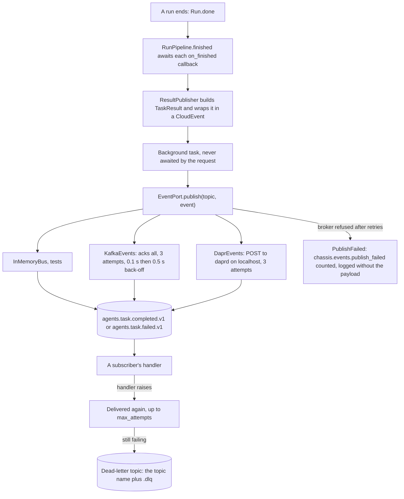

# PoC-4: how stateless and scalable works

Status: written 2026-10-01 and refreshed the same day after the review fixes. The code wins where this guide and the code differ.
Contract: [contract v3](../contracts/contract-v3.md). Design: [the PoC-4 plan](../plans/2026-10-01-poc-04-stateless-scalable.md). Tracking: [the PoC-4 README](../../pocs/poc-04-stateless-scalable/README.md). Events decision: [ADR-004](../planning/adr/004-events-through-a-broker-client.md) (proposed). Evidence: [drills](../../pocs/poc-04-stateless-scalable/notes/2026-10-01-drills.md), [load results](../../pocs/poc-04-stateless-scalable/notes/2026-10-01-load-results.md), [container roles](../../pocs/poc-04-stateless-scalable/notes/2026-10-01-container-roles.md), [Dapr against the broker client](../../pocs/poc-04-stateless-scalable/notes/2026-10-01-dapr-vs-broker.md). Open items: [the debt note](../../pocs/poc-04-stateless-scalable/notes/2026-10-01-debt.md).

## What PoC-4 adds

PoC-4 makes a chassis replica disposable. Everything a replica must not keep moves behind a port: the agent config into a versioned store (MinIO or S3, `ConfigPort`), the idempotency cache into a key-value store (Valkey, the new `StatePort`), and result events onto a broker (the new `EventPort`: a broker client in the chassis, Kafka today; Dapr was tried behind the same port and not chosen, [ADR-004](../planning/adr/004-events-through-a-broker-client.md)). A call with an `Idempotency-Key` runs once across all replicas; a repeat replays the first result on any replica. A replica tells the load balancer when it cannot serve (`/ready` with a `reason`), drains on SIGTERM without failing a call in flight, and reloads its config without a restart. What did not change ([contract v3](../contracts/contract-v3.md), "What did not change"): the event schema (`schema_version` stays `"0"`), the envelope, `handle`, and the A2A mapping. The public interfaces gain one header, three error codes, and a `/ready` reason; the status per format is the refusal table in contract v3.

## The pieces

Paths under `chassis/` are `packages/chassis/src/chassis/`.

| Piece | File | Port, flag, or config |
| ----- | ---- | --------------------- |
| Key-value state | `chassis/ports/state.py` (`StatePort`, `InMemoryState`, `StateUnavailable`) | `spec.adapters.state`: `memory`, `valkey` |
| Valkey adapter | `chassis/adapters/valkey/state.py` (`ValkeyState`) | `VALKEY_URL`, `VALKEY_USERNAME`, `VALKEY_PASSWORD` |
| Events | `chassis/ports/events.py` (`EventPort`, `CloudEvent`, `NoEvents`, `PublishFailed`), `chassis/fakes/events.py` (`InMemoryBus`) | `spec.adapters.events`: `none`, `memory`, `kafka`, `dapr` |
| Kafka adapter | `chassis/adapters/kafka/events.py` (`KafkaEvents`, aiokafka) | `KAFKA_BOOTSTRAP_SERVERS` |
| Dapr adapter | `chassis/adapters/dapr/events.py` (`DaprEvents`, httpx to daprd) | `DAPR_API_TOKEN`, `APP_API_TOKEN` |
| Config store | `chassis/adapters/s3/config.py` (`S3Config`, registered as `minio` and `s3`) | `spec.adapters.config`, `CONFIG_S3_*`, `CONFIG_POLL_INTERVAL_S` |
| Config reload | `chassis/server/config_loader.py` (`ConfigReloader`), `RELOADABLE` and `RESTART_ONLY` in `chassis/server/config.py` | the store document `agents/<agent.name>.yaml` |
| Idempotency | `chassis/server/idempotency.py` (`Idempotency`, `Claim`, `Replay`, `Refusal`), wired in `chassis/server/interfaces/serve.py` | `spec.idempotency`; header `Idempotent-Replayed: true` |
| Client disconnect | `chassis/server/interfaces/serve.py` (`DISCONNECT_POLL_S` 0.25) | complete mode on native, OpenAI, Anthropic |
| Readiness | `chassis/server/readiness.py` (`ReadinessMonitor`, `ProbeSettings`), `EngineConnector.probe()` | `GET /ready` with `reason` |
| Shutdown | `chassis/server/lifecycle.py` (`Drain`, `QuietServer`), `chassis/server/cli.py` | `--drain-delay-s`, `--drain-timeout-s` |
| Workload drain | `packages/workload-a2a` (`DrainingServer`), `packages/workloads/echo-typescript/src/drain.ts` | `--drain-timeout-s`, `DRAIN_TIMEOUT_MS` |
| Result events | `chassis/server/results.py` (`ResultPublisher`), `chassis/core/results.py` (`TaskResult`) | `spec.events.result_events` |
| Schemas | `packages/chassis/schemas/chassis-config.v0.json`, `task-result.v1.json` | `make schemas` |
| Profiles | `chassis/profiles.py`: lazy `REGISTRY` entries, an unused SDK is never imported | `spec.adapters.state`, `.events` |
| Suites | `packages/contract-suites/src/chassis_contracts/state.py`, `events.py`, `config.py`, `engine.py` (probe), `containers/` | testcontainer helpers |
| Compose scale stack | `deploy/compose/docker-compose.scale.yaml`, `docker-compose.scale-dapr.yaml`, `traefik/`, `dapr/`, `scale.sh`; `packages/chassis/configs/scale*.yaml` | project `poc04`, Traefik on `127.0.0.1:18080` |
| kind | `deploy/kind/` (`cluster.yaml`, `run.sh`, `poc04/base`, `native-sidecar`, `prestop`, `typescript`) | cluster `poc04`, `127.0.0.1:18081` |
| Load and drills | `pocs/poc-04-stateless-scalable/load/` | `make load-test`, `kill_drill.py`, `steady_client.py` |

## The scale stack



A pair is one chassis and one workload. The workload joins the chassis's network namespace (`network_mode: service:chassis-N`), so `127.0.0.1` is shared inside the pair and nowhere else. The workload listens on `127.0.0.1:9000` and reaches only the chassis's proxy on `127.0.0.1:8090` (`CHASSIS_MODEL_URL`, `CHASSIS_TOOL_URL`). Only the chassis gets credentials: `VALKEY_PASSWORD`, `CONFIG_S3_ACCESS_KEY`, `CONFIG_S3_SECRET_KEY`, and in the Dapr overlay `DAPR_API_TOKEN` and `APP_API_TOKEN` (shared with daprd). `scale.sh` generates them into `deploy/compose/.env.poc04` and never prints them. Pairs are explicit services: pair 1 always starts, `--profile pairs2` adds pair 2, `--profile pairs4` adds pairs 2 to 4. Traefik lists all four and sends traffic only to a chassis whose `/ready` is 200. suggested: the check runs every 2 s with a 3 s timeout (`deploy/compose/traefik/poc04.yaml`; the plan's 1 s timeout caused bursts of 503 under load). Known gap: the PoC Kafka listener is PLAINTEXT with no auth (`deploy/compose/SECURITY.md`, section 7).

## An idempotent call



Idempotency applies only to a key the client sent: the `Idempotency-Key` header or the native body's `idempotency_key`. A call with no key never touches `StatePort`. The store key is `chassis:idem:v1:<agent>:<sha256 of the key>`. The fingerprint is the sha256 of `{agent, input, context_ref}`, so a retry that switches to streaming, changes its budget, or comes in through another interface still matches. A replay opens no run, calls neither the engine nor the model, and charges nothing. It works on native, OpenAI, and Anthropic, complete and stream. MCP clients get the same envelope but cannot see the header. Only a run that ended with `end` is cached. An error or a client that left frees the key, so the next retry runs again. A result over `max_entry_bytes` stores a small `too_large` marker instead, so the agent never runs twice for one key: a repeat gets a final 409 `idempotency_in_progress` whose text says the result was too large to cache. A duplicate that waited and then takes the key over runs with what is left of its own `budget.timeout_ms` (at least 500 ms, suggested: `MIN_RUN_MS`), so the client waits about one timeout, not two. If the store fails or holds an entry that cannot be read, a keyed call gets 503 `state_unavailable` (suggested: fail closed). Defaults, all suggested: `ttl_s` 86400, `lease_s` 5, `wait_poll_ms` 100, `max_entry_bytes` 1048576.

A complete call whose client hangs up is cancelled. A watcher polls `is_disconnected` every 0.25 s; on a disconnect the run's events close, which cancels the A2A task, frees the run's budget, and releases the claim. MCP has no watcher: its inner hop does not see the client leave.

## A killed replica



A claim is a lease, not a lock. The owner renews it while the run is alive. When the owner dies, the lease runs out after `lease_s` and the next retry takes the key over (`chassis.idempotency.taken_over`). If the dead replica had already cached the result, the retry replays it instead. A claim that lost its lease never writes again (`Claim.lost`). A replica that is alive but cut off from the store is fenced on its own clock: when no renew got through for `0.8 * lease_s` (suggested: `FENCE_FRACTION`), it cancels its run and answers 409 `idempotency_in_progress`, retryable, before another replica can take the key over (`tests/test_killed_replica.py::test_a_replica_cut_off_from_the_store_mid_run_is_fenced`). The Compose kill drill measured the dead-replica case: 582 sent, 582 ok, 0 lost (`notes/2026-10-01-drills.md`, section 2); the recorded demo after the review fixes, 3,284 sent, 3,284 ok, and 24 of 24 retried keys replayed the same envelope (`demo/2026-10-01-demo-scale.md`).

## Config reload



The bootstrap file (`chassis serve --config`) names the profile, the agent, `spec.adapters`, and `spec.engine`. With a real config adapter, the store document `agents/<agent.name>.yaml` is a whole `ChassisConfig`; a missing or invalid one fails startup. With `config: memory` the bootstrap file is the config. Only `version`, `spec.limits`, `spec.model.route`, `spec.prompt`, and `spec.idempotency.ttl_s` reload. Any other changed path is refused with `restart_required`. The log names field paths, never values. A run keeps the context it opened with; the next request reads the new config. A store document's `versions.config` names its content: `<version>+<hash12>` when the document sets `version`, else `<hash12>` (the first 12 hex of the sha256 of the parsed document), so every replica that reads the same bytes reports the same value. `BodyLimit` reads the live `body_bytes_max` per request. `/openapi.json` still shows the limits from startup. suggested: poll every 5 s with ±10% jitter. The live drill took a new limit within one poll and refused a bad document by path, on both replicas, with no restart (`load/reload_drill.py`; `notes/2026-10-01-drills.md`, section 4 and "Rerun after the review fixes").

## Readiness



`ReadinessMonitor` calls `EngineConnector.probe()` every 2 s, each probe bounded by 1 s. Three failures in a row make the workload unhealthy; one success makes it healthy again (`ProbeSettings(interval_s=2.0, timeout_s=1.0, failures=3)`, all suggested, no CLI flag). The sidecar probe is a GET of the workload's agent card. `/ready` reads the cached result and never calls the workload itself. Draining wins over every other state. `/health` never looks at the workload, so a hung workload never restarts the chassis. In Kubernetes the workload gets its own exec liveness probe on the agent card, and that restarts it. The Compose hung drill (`docker pause`) saw `/ready` turn 503 `workload_unreachable` after 9.7 s and 200 again 2.0 s after the unpause; 40 of 40 calls through Traefik succeeded meanwhile (`notes/2026-10-01-drills.md`, section 6).

## Graceful shutdown of a pair



The chassis handles SIGTERM itself. Both uvicorn servers are `QuietServer`s that install no signal handlers; `lifecycle.handle_signals` installs one. A second signal forces both servers out. The proxy listener closes last because a workload that is still running calls the model proxy and the tool endpoint. From the signal on, every public response carries `Connection: close` (`CloseWhenDraining`), so a keep-alive client moves to another replica; the proxy listener never sends it. A connection that stays idle through the whole delay never sees the header, so `--drain-delay-s` must exceed endpoint removal plus the clients' idle keep-alive window. Defaults are suggested: `--drain-delay-s 5`, `--drain-timeout-s 30`; Compose uses `--drain-delay-s 3`, the native-sidecar manifests `--drain-delay-s 10`. The workload drains too: `workload_a2a`'s `DrainingServer` and `--drain-timeout-s` (Python), and `drain.ts` with `DRAIN_TIMEOUT_MS` (TypeScript; a call that outlives it exits 1).

In Compose, `docker compose stop` would stop the workload first, so the drill sends SIGTERM to the chassis, waits for it, then stops the workload. It failed 0 of 691 calls with no retry (`notes/2026-10-01-drills.md`, section 3), and 0 of 1,997 in the recorded demo. Kubernetes has two variants under `deploy/kind/poc04/`:

- **Native sidecar, the chosen variant.** The workload is an init container with `restartPolicy: Always`; the chassis is the main container. On delete the chassis gets SIGTERM first, with `--drain-delay-s 10`. The workload gets SIGTERM only after the chassis exits. Grace 50 s (suggested: 10 + 30 + 10).
- **preStop.** Two plain containers. Both get their preStop at once. The chassis sleeps 5 s, then gets SIGTERM with `--drain-delay-s 0`. The workload sleeps 35 s (the chassis's preStop plus its drain timeout), so it gets SIGTERM after the chassis is done. Grace 50 s. Both use the built-in `sleep` action, so a read-only image needs no `sleep` binary.

The kind result (`notes/2026-10-01-container-roles.md`): before the drain fix, both variants lost a few calls per rolling restart (native sidecar 28 of 51,848, preStop 28 of 72,338), all on keep-alive connections at the moment a chassis closed its listener. After `Connection: close` and the 10 s delay, the native sidecar failed 0 calls in six rolling restarts on both engines. preStop still loses calls on echo-typescript: during its sleep the chassis does not know it is draining. The native sidecar goes to 024 CH-3.

## Result events



With `spec.events.result_events: true`, the lifespan adds a `ResultPublisher` to `RunPipeline.on_finished`. A run with an `end` event publishes `agents.task.completed.v1`; a run with an `error` event publishes `agents.task.failed.v1`. The payload is `TaskResult` (`schemas/task-result.v1.json`). The CloudEvent `id` is fixed per run and type (a uuid5 of the type and the `request_id`), so a consumer dedupes a second delivery by `id`. `idempotencykey` and `partitionkey` carry the sha256 hex of the run's idempotency key, never the key itself, so one key's events keep their order and a reader of the topic cannot learn the key; `TaskResult.idempotency_key` holds the same hash. A replay and a run the client left publish nothing. Delivery is at least once, so a consumer dedupes by `id`. The dead-letter event carries `deadletterreason` (the exception class only) and `deadletterattempts`. On Kafka the adapter retries in place; on Dapr the subscription's `deadLetterTopic` and `deploy/compose/dapr/resiliency.yaml` do it. Dapr's inbound routes (`/dapr/subscribe`, `/dapr/events/{topic}`) are mounted on the proxy app only, behind `APP_API_TOKEN`. At shutdown the publisher waits for pending publishes up to 5 s (suggested), then counts the rest as `chassis.events.publish_abandoned`. Event-triggered runs are not built: a non-null `spec.events.consume` is refused at load.

## How to run it

The offline gate. No Docker, no keys, sockets off; two replicas are two chassis apps on Unix sockets that share one `InMemoryState` and one `InMemoryBus`.

```bash
make test
make test-poc POC=04
```

The integration tests: real adapters in testcontainers (`packages/chassis/tests/integration/`) and the `network` scenarios in `pocs/poc-04-stateless-scalable/tests/`. Needs Docker. Sockets on, keys stripped (`scripts/check_integration.sh`). Compose drills also need `POC04_STACK=1`; kind drills `POC04_KIND=1`.

```bash
make test-integration
POC04_STACK=1 uv run pytest pocs/poc-04-stateless-scalable/tests/test_compose_scale.py -v -p no:randomly
```

The Compose scale stack (`deploy/compose/scale.sh`, project `poc04`):

```bash
deploy/compose/scale.sh build                                  # chassis, fake model server, four workloads
deploy/compose/scale.sh up echo-python 2                       # engine, then 1, 2, or 4 pairs
deploy/compose/scale.sh up echo-python 1 --events kafka        # or --events dapr
deploy/compose/scale.sh ps
deploy/compose/scale.sh down                                   # project poc04 only, and its secrets file
```

`<engine>` is `echo-python`, `echo-pydanticai`, `echo-langgraph`, `echo-typescript`, or `inprocess` (1 pair only).

The drills (`pocs/poc-04-stateless-scalable/load/README.md`):

```bash
deploy/compose/scale.sh up echo-python 2
uv run python pocs/poc-04-stateless-scalable/load/kill_drill.py --mode kill --pair 2 \
  --out pocs/poc-04-stateless-scalable/notes/load/drill-kill.json
deploy/compose/scale.sh up echo-python 2      # a fresh stack: the killed pair is gone
uv run python pocs/poc-04-stateless-scalable/load/kill_drill.py --mode graceful --pair 2
deploy/compose/scale.sh down
```

The config drill is `uv run python pocs/poc-04-stateless-scalable/load/reload_drill.py` on a running stack; it checks every step, exits 1 on a failure, and restores the seed document. The first hand-run version and the hung-workload drill are in `notes/drills/` (`mc.sh`, `probe.py`, `good.yaml`, `bad.yaml`, `hung.py`). The recorded demo runs the kill, graceful, and reload drills in one go: `pocs/poc-04-stateless-scalable/demo/demo.sh`. `notes/2026-10-01-drills.md` shows each run.

The load matrix (Locust through `uv run --with`, never a workspace dependency):

```bash
make load-test ARGS="--dry-run"                               # the plan, nothing runs
make load-test ARGS="--engine echo-python --pairs 1"          # one engine, one pair count
make load-test ARGS="--engine echo-typescript"                # one engine, 1, 2, and 4 pairs
make load-test ARGS="--only hop"                              # the sidecar hop only
```

Results go to `pocs/poc-04-stateless-scalable/notes/load/results.json`, which `tests/test_load_results.py` reads.

kind (`deploy/README.md`, section "kind (PoC-4)"):

```bash
make kind-poc04 ARGS="up native-sidecar"            # create, build, kind load, apply (echo-python)
make kind-poc04 ARGS="apply prestop typescript"     # switch variant or engine
make kind-poc04 ARGS="drill-rolling"                # rollout restart under 20 clients, no retry
make kind-poc04 ARGS="drill-hung"                   # SIGSTOP one workload from the node
make kind-poc04 ARGS="delete"                       # kind delete cluster --name poc04
```

## What is not done yet

As of 2026-10-01. The full list, each item with its owner, is [the debt note](../../pocs/poc-04-stateless-scalable/notes/2026-10-01-debt.md); the README checklist is the record.

- **Throughput grows in only 4 of 8 steps** (exit criterion 4, flagged). echo-pydanticai grows from 1 to 2 to 4 pairs; echo-langgraph and echo-typescript grow from 1 to 2. echo-python 1 to 2 and 2 to 4, echo-langgraph 2 to 4, and echo-typescript 2 to 4 are strict xfails in `tests/test_load_results.py`. 4 pairs do not fit the 7.9 GiB Docker Desktop VM, and CPU per call swings up to 2x between identical runs there. Needs a Linux host or pinned CPUs.
- **The sidecar hop is not isolated.** It is below the method's 1 ms resolution; a direct figure needs a chassis-side timer.
- **ADR-001's Revisit input.** At 10 RPS the chassis uses 0.105 to 0.129 vCPU, at or just above the top of 0.05 to 0.1; memory (150 to 182 MiB) is inside the range. Sent to the epic owner through 122 X-5.
- **ADR-004 is Proposed.** The 019 H-17 body changes wait for its acceptance.
- **Event-triggered runs** are not built.
- **Idempotency gaps:** scoped per agent, not per caller, until auth (PoC-8); no per-caller quota, so any caller can fill Valkey; size Valkey as rate × TTL × about 1.5 KB; the 503 text says "cannot reach" when the store is full.
- **Kafka is open in the PoC** (PLAINTEXT, no auth), and result events carry `input` and `output` (020 X-8, 019 H-17).
- **Known limits kept:** `/openapi.json` shows the startup limits after a reload; MCP calls are bounded by `budget.timeout_ms` only, since the inner hop does not see the client leave; the preStop variant still loses calls on echo-typescript.
- **Contract.** [contract v3](../contracts/contract-v3.md), "Known gaps", records the rest.
