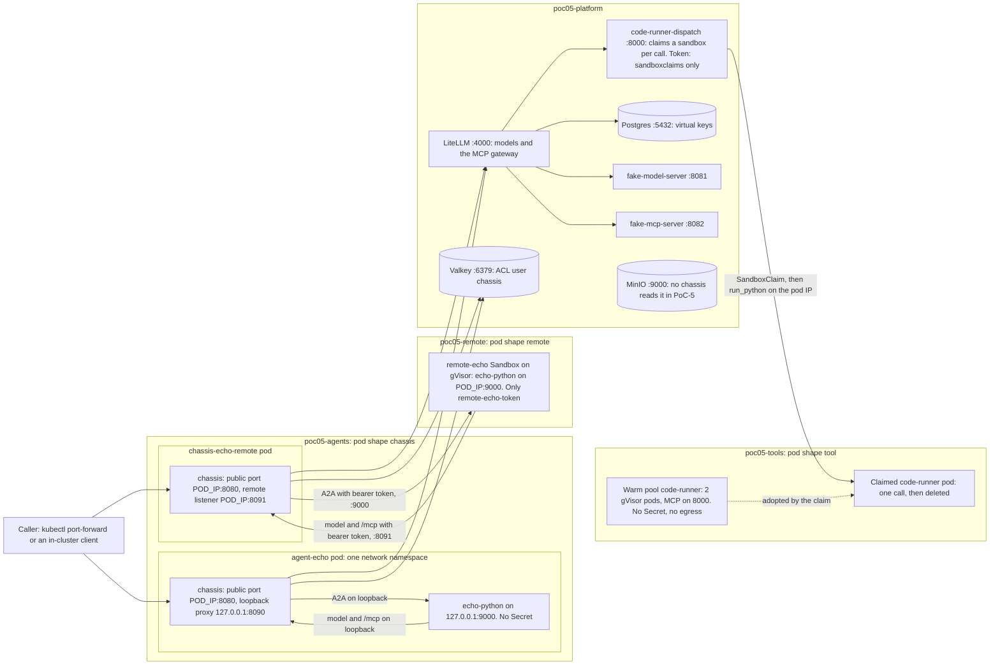
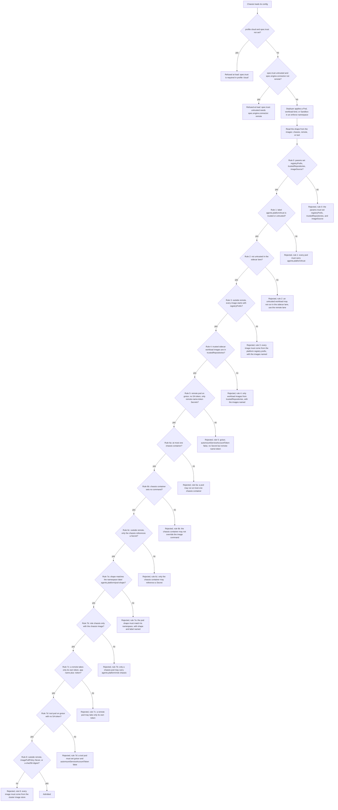
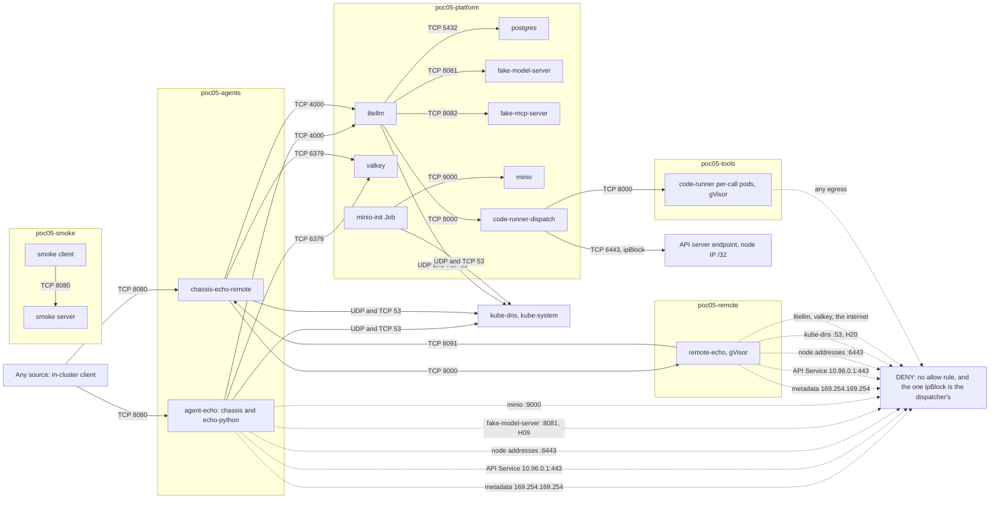
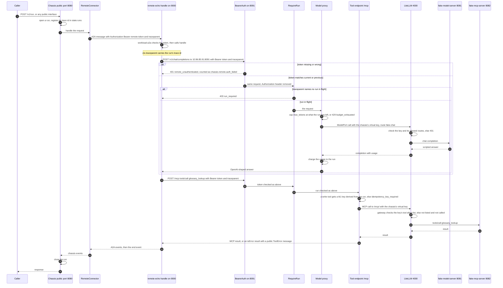
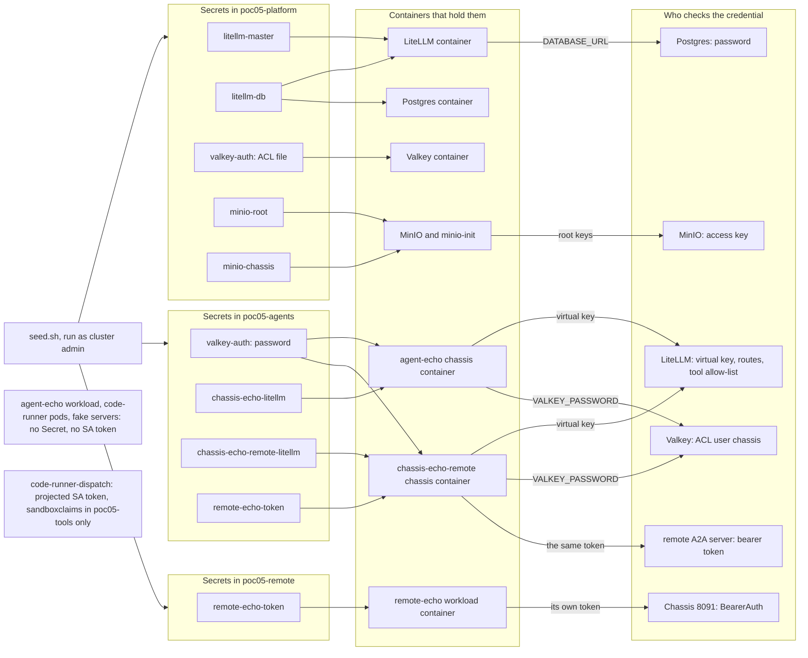

# PoC-5: how sandboxed works

Status: written 2026-10-02 (T28), before the kind suites ran. Evidence cells updated 2026-10-09 (T27) from the T19, T21, and T22 notes. Updated again 2026-10-09 for the code runner's sandbox per call ([per-call plan](../plans/2026-10-09-poc-05-per-call-sandbox.md)). The code and the manifests win where this guide and they differ.
Contract: [contract v4](../contracts/contract-v4.md). Design: [the PoC-5 plan](../plans/2026-10-02-poc-05-sandboxed.md). Tracking: [the PoC-5 README](../../pocs/poc-05-sandboxed/README.md). Decision: [ADR-005](../planning/adr/005-remote-lane-auth-and-trust-admission.md). Threats: [the threat model](../../pocs/poc-05-sandboxed/notes/2026-10-02-threat-model.md). Reviews: [security](../../pocs/poc-05-sandboxed/notes/2026-10-02-review-security.md), [code](../../pocs/poc-05-sandboxed/notes/2026-10-02-review-code.md). Bring-up: [the kind bring-up note](../../pocs/poc-05-sandboxed/notes/2026-10-02-bring-up.md). Limits: [the blind-spots note](../../pocs/poc-05-sandboxed/notes/2026-10-02-blind-spots.md).

Paths under `chassis/` are `packages/chassis/src/chassis/`. Manifests are under `deploy/kind/poc05/`.

## 1. The question and the answer

**The question.** Can a workload whose code we do not trust run behind the chassis without reaching a credential, an internal service, or the outside world on its own?

**The answer, in three sentences.** A trusted workload stays in the `sidecar` lane, next to the chassis in one pod, and every internal service refuses it unless the call carries the chassis's credential. An untrusted workload runs in the `remote` lane: its own pod on gVisor, with no Secret but its own token, and a network that reaches only its chassis's listener on 8091, where `BearerAuth` and `RequireRun` let it spend only inside a run the chassis opened. The trust rule is checked twice, in the chassis config at load and by an admission policy on the cluster, so an untrusted pod cannot land next to the chassis.

**What is proven so far.** The offline tests check the chassis code, the config rule, and a static model of every manifest (`make test-poc POC=05`). The stack comes up on kind from nothing with one command ([bring-up](../../pocs/poc-05-sandboxed/notes/2026-10-02-bring-up.md)). The kind suites ran on 2026-10-08 and again on 2026-10-09: the sidecar suite and admission on the API server ([sidecar suite](../../pocs/poc-05-sandboxed/notes/2026-10-08-sidecar-suite.md)), and the remote lane and the code runner ([remote suite](../../pocs/poc-05-sandboxed/notes/2026-10-08-remote-suite.md)). On the per-call layout (remote suite, 2026-10-09) the kind tier gave 146 passed, 2 skipped, 1 xfailed, and `run.sh test-remote` 21 passed, 1 xfailed; the xfail is the `/dev/shm` cap under gVisor. Each diagram still shows what the code and the manifests say; section 7 links each control to the test that ran it.

## 2. Pod topology of both lanes

Four namespaces run the pods below. Every PoC-5 namespace (those four, plus `agent-platform-system`, `poc05-tenant`, and `poc05-smoke`) has a `default-deny` NetworkPolicy both ways (`base/default-deny.yaml`) and enforces the restricted Pod Security Standard. The admission policy binds to the three that run workloads (`agents.platform/admission: enforce`).

| Pod | Namespace | Lane or role | Runtime | Containers |
| --- | --------- | ------------ | ------- | ---------- |
| `agent-echo` | `poc05-agents` | `sidecar`, trusted | `runc` | chassis (native sidecar, init container with `restartPolicy: Always`) and `echo-python` |
| `chassis-echo-remote` | `poc05-agents` | `remote`, the chassis half | `runc` | chassis only |
| `remote-echo` (`Sandbox`) | `poc05-remote` | `remote`, the workload half, untrusted | gVisor | `echo-python` on the `workload-a2a` template |
| `code-runner-<id>`, one per call, from the warm pool `code-runner` | `poc05-tools` | the code-execution tool, a fresh sandbox per call | gVisor | `code-runner` |
| `code-runner-dispatch` | `poc05-platform` | platform: takes each code-runner call and claims a sandbox for it | `runc` | `code-runner dispatch` |
| LiteLLM, Postgres, Valkey, MinIO, `minio-init`, fake model, fake MCP | `poc05-platform` | platform | `runc` | one each |



- **Sidecar lane.** The two containers share one network namespace. A NetworkPolicy cannot tell them apart, so the workload can open any socket the chassis can. That is why every service must refuse a call without the chassis's credential, and why untrusted code goes remote.
- **Remote lane.** The workload has its own pod, on gVisor, in its own namespace. It finds the chassis by a fixed ClusterIP (`10.96.85.91`, the Service `chassis-echo-remote-proxy`), given as plain env, because it has no DNS. The chassis finds it by name (`remote-echo.poc05-remote.svc.cluster.local:9000`).
- **The public port** binds the pod IP in both lanes. So localhost in the sidecar pod carries only the loopback proxy (8090) and the workload (9000).
- **Tools.** A workload never reaches a tool server. It calls `/mcp` on its chassis; the chassis calls LiteLLM's MCP gateway with its own virtual key; the gateway calls `fake-mcp-server` or `code-runner-dispatch`.
- **The code runner, a sandbox per call.** The dispatcher is the only server LiteLLM registers as `code_runner`. It never runs code itself (next section).
- **Kafka with SASL** runs in `poc05-platform` with the agent `agent-echo-events`, added by `run.sh kafka` (decision 2026-10-09). H11 passed ([close runs](../../pocs/poc-05-sandboxed/notes/2026-10-09-close-runs.md), section 3). The two echo agents still set `spec.adapters.events: none`.
- **The in-pod probe workload (T10): a recorded exception**, work in progress, owner the user ([the T10 note](../../pocs/poc-05-sandboxed/notes/2026-10-09-t10-probe-exception.md)). It is not deployed.

### The code runner: one sandbox per call

The code runner used to be one shared `Sandbox`. One call could fill its memory and restart it for every caller, and files left in `/tmp` reached the next caller (security review, 2026-10-09). Now each call gets a fresh gVisor pod. The agent-sandbox controller runs with its extensions: a `SandboxTemplate` (the pod), a `SandboxWarmPool` (2 started pods, `suggested:`), and a `SandboxClaim` per call. Code: `packages/code-runner/src/code_runner/dispatch.py`. Manifests: `tools/code-runner.yaml`, `platform/code-runner-dispatch.yaml`.

```mermaid
sequenceDiagram
    autonumber
    participant L as LiteLLM MCP gateway
    participant D as code-runner-dispatch
    participant K as Kubernetes API
    participant C as agent-sandbox controller
    participant S as Claimed code-runner pod, gVisor

    L->>D: tools/call run_python with code, timeout, idempotency key
    alt key seen before
        D-->>L: the first result, no claim
    else new key
        D->>D: take a slot, at most 2 claims at once
        D->>K: POST SandboxClaim, warmPoolRef code-runner, shutdownPolicy Delete, shutdownTime now + 60 s
        C->>K: adopt a warm pod, or cold-start one after 2 s
        loop every 100 ms, up to 20 s
            D->>K: GET the claim
        end
        alt not Ready in 20 s
            D-->>L: sandbox_unavailable, nothing ran
        else Ready, podIPs set
            D->>S: run_python on podIP:8000, no Authorization header
            S-->>D: exit_code, stdout, stderr, timed_out
            D-->>L: the result, or sandbox_lost if the pod ended or answered over 256 KiB
        end
        D->>K: DELETE the claim, on every path
        C->>K: delete the Sandbox and its pod; the pool starts a new one
    end
```

- **The dispatcher holds one credential.** A projected service account token with `create`, `get`, and `delete` on `sandboxclaims` in `poc05-tools` only. It holds no model or tool key. The token goes only to the API client; the sandbox client sends no auth (`dispatch.py`, two separate `httpx` clients).
- **Nothing from the caller goes into a Kubernetes object.** The claim has a generated name, the pool name, and `lifecycle` only.
- **A pod is never reused.** Files and processes die with the claim. The idempotency cache lives in the dispatcher, so a repeated key needs no claim, and a failed call frees its key.
- **Orphans expire.** A claim the dispatcher could not delete is removed at its `shutdownTime`.
- **Limits.** A ResourceQuota in `poc05-tools` allows 4 claims and 6 pods (`suggested:`). A per-call pod has 256Mi memory, request equal to limit, and no liveness probe.
- **Evidence.** Offline: `packages/code-runner/tests/test_code_runner_dispatch.py`. Kind: the bring-up note, 2026-10-09 (claim latency warm 0.23 s, cold 4.45 s; the quota; the `can-i` list), and `test_poc05_kind_code_runner.py` ([remote suite](../../pocs/poc-05-sandboxed/notes/2026-10-08-remote-suite.md), 2026-10-09).

## 3. The trust rule: config load, then admission

The rule is checked in two places. The chassis checks its own config at load (`spec.trust` against `spec.engine.connector`, `chassis/server/config.py`). The cluster checks every pod and pod template with the `ValidatingAdmissionPolicy` `agent-trust-rule` (`admission/policy.yaml`). It reads the pod shape from the images, never from a label alone:

- **chassis shape:** at least one image is `registryPrefix` + `chassis`. With any other image next to it, the pod is in the `sidecar` lane.
- **remote shape:** no chassis image, and `agents.platform/lane: remote` or `agents.platform/trust: untrusted`.
- **tool shape:** anything else.

The params are the ConfigMap `agent-platform-system/agent-trust-params` (on kind: `registryPrefix: kind.local/agent-platform/`, `imageSource: pull-never`, and the two echo repositories as `trustedRepositories`). The binding uses `failurePolicy: Fail` and `parameterNotFoundAction: Deny`, so missing params deny everything. The policy runs every validation, and the API server reports each one that fails. The flow below draws them in order for reading. Each message starts `trust rule <n>:`; the diagram shortens it.



- **The two checks are independent.** A config that passes the chassis still needs an admitted pod, and the reverse. The chassis's check stops a wrong config; admission stops a wrong pod, whoever wrote it.
- **The trust label is one-way.** `untrusted` is always believed. `trusted` counts only when `trustedRepositories` agrees (rule 4). The probe image `kind.local/agent-platform/hostile` is left off that list on purpose.
- **Rules 3 and 5 are stricter than the plan** (contract v4, "Rules 3 and 5 are stricter than the plan"): rule 3 applies outside the remote lane, not only in `sidecar`, and covers ephemeral containers; rule 5 refuses every Secret reference but `remote-<name>-token`, and a projected service account token.
- **Who may change it.** The submitter and the deployer cannot edit the params; only `agents.platform:platform-admins` may (`admission/rbac.yaml`).
- **Templates and claims.** `agent-trust-rule` also checks a `SandboxTemplate`'s pod. A second set of rules (`admission/extension-policy.yaml`) holds templates to `Unmanaged` network policy, no env injection, no volume claims, and no `networkPolicy` of their own (T1 to T5), and claims to the `code-runner` pool, `shutdownPolicy: Delete` with a `shutdownTime`, and no env, pod metadata, or volume claims (C1 to C5).
- **Evidence.** `test_poc05_trust_config.py` covers the config rule. `test_poc05_admission_static.py` checks a Python model of the CEL, with a rejected fixture and an admitted twin per rule (`admission/fixtures/`). On kind, `test_poc05_kind_admission.py` runs the CEL on the API server: 51 passed, each rejected fixture refused with its rule's message and its twin admitted ([sidecar suite](../../pocs/poc-05-sandboxed/notes/2026-10-08-sidecar-suite.md)). The header of `policy.yaml` lists what only the cluster can prove.

## 4. The NetworkPolicy map

The edges below are `pocs/poc-05-sandboxed/tests/fixtures/netpol_edges.yaml`. `test_poc05_netpol_static.py` computes the edges from the policies under `deploy/kind/poc05/` and requires them to equal that file, both ways. The fixture lists 19 egress and 15 ingress edges, and one `ipBlock`. The edges of the Kafka pass (`agent-echo-events` and `kafka`) are in the fixture but not drawn. Inside the PoC-5 namespaces, every egress edge has its matching ingress edge, so each line below is one allowed connection:

- **Solid line:** allowed, with its ports.
- **Egress only:** kube-dns is in `kube-system`, which has no PoC-5 default deny.
- **Ingress only:** 8080 on the two chassis pods, from any source (the one rule with ports and no `from`).
- **LiteLLM and Valkey ingress** select `agents.platform/role: chassis` in `poc05-agents`. Both agent pods carry that label, and admission rule 7b keeps it on chassis pods only.
- **Dashed line:** a named destination with no allow rule. One rule under `deploy/kind/poc05/` uses an `ipBlock`: the dispatcher's egress to the API server endpoint, a `/32` on 6443 (a recorded B4 exception). No other pod can reach the metadata service, the API, or a node. The cluster-wide `AdminNetworkPolicy` that would name them in one object is not installed: the API is absent on this kind. The static no-`ipBlock` test is the control (`base/default-deny.yaml`).



What the map says, in words:

- **The remote sandbox** has exactly one egress edge: its chassis on 8091. It has no DNS. Its 9000 takes only its own chassis pod.
- **8091** takes only the pod labeled `app.kubernetes.io/name: remote-echo` in `poc05-remote`. Its bearer token is the second lock (section 5).
- **The sidecar pod** has the chassis's egress, and so does its workload, because they share one network namespace. So `agent-echo` can reach LiteLLM and Valkey at the network level. Each must refuse it without the chassis's credential (section 6). DNS stays open in this lane: a recorded blind spot (H20).
- **The fake servers and Postgres** take LiteLLM only and have no egress. No agent pod has a route to the model server (the H09 fix).
- **The code-runner pods** take 8000 from the dispatcher only, and have no egress at all, not even DNS. A sandbox cannot reach another sandbox, the dispatcher, LiteLLM, or the API.
- **The dispatcher** takes 8000 from LiteLLM. It reaches the sandboxes on 8000 and the API server endpoint on 6443. It has no DNS. `run.sh` fills the endpoint address from the `kubernetes` EndpointSlice and refuses a sentinel, link-local, pod, or service address.
- **MinIO** takes only `minio-init`. No chassis uses `config: s3` in PoC-5 (security review F10), so no chassis edge.
- **Not in the map:** the probe pods (T10, a recorded exception, [the T10 note](../../pocs/poc-05-sandboxed/notes/2026-10-09-t10-probe-exception.md)). Kafka and `agent-echo-events`, added at the close by `run.sh kafka` (`platform/kafka.yaml`, `agents/agent-echo-events.yaml`). Their edges are in `netpol_edges.yaml` but not drawn here: Kafka takes `agent-echo-events` only, on its SASL port.
- **What this does not prove:** that kindnet drops the packets. The kind suites test that (H01, H03, H04, H18, H19, H20, H30), each with a paired allowed control, and they ran on 2026-10-08 and 2026-10-09. kindnet does not log a drop.

## 5. The remote-lane request path

One run through `chassis-echo-remote` and `remote-echo`, with one model call and one tool call. The code: the client side is `chassis/adapters/a2a/remote.py` (`RemoteConnector`) over `A2AConnector`; the listener is `chassis/server/remote_auth.py`; the model pass-through is `chassis/server/model_proxy.py`; the tool endpoint is `chassis/server/tool_endpoint.py` over `McpGatewayTools` (`chassis/adapters/mcp/gateway.py`). The workload side is the `workload-a2a` template started with `--require-token-env CHASSIS_API_TOKEN`.



- **Two tokens, two directions, one value.** The chassis sends `remote-echo-token` to the remote on every A2A request, the card fetch and the probe included. The remote sends the same value back on 8091. `seed.sh` writes one value into two Secrets, one per namespace. During a rotation the listener also accepts `previous_token_env`.
- **The token never reaches a route or a log.** `BearerAuth` compares against every accepted token with `hmac.compare_digest`, with no early exit, then removes the header. It logs the method and the path only.
- **The remote never holds a model or tool key.** The model proxy forwards no inbound `Authorization` and adds none. The model adapter and `McpGatewayTools` hold the chassis's virtual key (`chassis-echo-remote-litellm`).
- **The run check binds spend to a run.** A remote can spend tokens and call tools only while a run the chassis opened is in flight, under that run's budget.
- **The listener serves two routes only.** `POST /v1/chat/completions` and `/mcp`. Every other path is 404, after both checks. A websocket is closed with 1008.
- **Known gap.** The token crosses the pod network in plain HTTP both ways (security review F14, recorded). mTLS is the next step (ADR-005).
- **Evidence.** Offline: `packages/chassis/tests/test_remote_auth.py`, `test_poc05_remote_lane_offline.py`, and `test_poc05_remote_lane_contract.py` (the same `LaneContract` over `inprocess`, `sidecar`, and `remote`, on Unix sockets). On kind: H17 and the remote-lane contract against the cluster pass ([remote suite](../../pocs/poc-05-sandboxed/notes/2026-10-08-remote-suite.md)). H29 is offline only; no PoC-5 kind test runs it.

## 6. The credential map

Every Secret is made at run time by `deploy/kind/poc05/platform/seed.sh`, run as the cluster admin, with `openssl rand -hex`. No value is in any file under `deploy/`. `seed.sh status` prints names only. Only the chassis holds a credential for an internal service (ADR-001 hard requirement 1). The one credential a workload holds is its own remote token, which opens only its own chassis's listener.

| Secret | Namespace | Container that holds it, and how | Refuses a caller without it |
| ------ | --------- | -------------------------------- | --------------------------- |
| `litellm-master` | `poc05-platform` | LiteLLM, env `LITELLM_MASTER_KEY` | LiteLLM's admin API: no virtual key is made or changed without it. `seed.sh` sends it as a header on stdin through a port-forward |
| `litellm-db` | `poc05-platform` | Postgres, a mounted file (`POSTGRES_PASSWORD_FILE`); LiteLLM, env, expanded into `DATABASE_URL` | Postgres |
| `valkey-auth` | `poc05-platform` | Valkey, `auth.conf` mounted (the ACL user `chassis` by the SHA-256 of its password; the `default` user is off) | Valkey: `NOAUTH` with no login, `WRONGPASS` with a guessed one (H10) |
| `valkey-auth` | `poc05-agents` | The chassis container of `agent-echo` and of `chassis-echo-remote`, env `VALKEY_PASSWORD` | as above |
| `minio-root` | `poc05-platform` | MinIO and `minio-init`, `envFrom` | MinIO (H12) |
| `minio-chassis` | `poc05-platform` | `minio-init` only, to make the read-only chassis user. No chassis holds it in PoC-5 (`config: memory`) | MinIO |
| `chassis-echo-litellm` | `poc05-agents` | The chassis container of `agent-echo`, env `LITELLM_API_KEY` | LiteLLM models and the MCP gateway: 401 with no key or an unknown key (H05, H06, H07). The key has only its own route, its own tool allow-list, and no management routes |
| `chassis-echo-remote-litellm` | `poc05-agents` | The chassis container of `chassis-echo-remote`, env `LITELLM_API_KEY` | as above |
| `remote-echo-token` | `poc05-agents` | The chassis container of `chassis-echo-remote`, env `REMOTE_TOKEN` | The chassis's remote listener on 8091: 401 `remote_unauthenticated` (H17). Without it the chassis refuses `--remote-proxy-host` and does not start |
| `remote-echo-token` | `poc05-remote` | The `remote-echo` workload, env `CHASSIS_API_TOKEN` | The remote's A2A server: it refuses every path without the token, the agent card included |

The probe workload's keys are not in the map: T10 is a recorded exception, work in progress, owner the user ([the T10 note](../../pocs/poc-05-sandboxed/notes/2026-10-09-t10-probe-exception.md)).

The `agent-echo` workload container, the code-runner pods, the dispatcher, the fake model server, and the fake MCP server hold no Secret. One pod mounts a service account token: `code-runner-dispatch`, a projected token whose rights are `create`, `get`, and `delete` on `sandboxclaims` in `poc05-tools`. Every other pod sets `automountServiceAccountToken: false`; rules 5 and 7d enforce it for remote and tool pods.

**Who can read a Secret.**

- **Through the API:** the cluster admin, who runs `seed.sh`. The submitter (`poc05-tenant/submitter`) and the deployer (`agent-platform-system/deployer`) have no access to Secrets (`admission/rbac.yaml`).
- **Through a pod:** anyone who may create a pod in a namespace can mount that namespace's Secrets. So the submitter has nothing in `poc05-agents`, where the chassis Secrets live; it may submit only in `poc05-remote` and `poc05-tools`. The deployer may create pods in `poc05-agents`, so admission limits what those pods may do: one chassis container (6a), with its own entrypoint (6b), the only container with a Secret (6c). In `poc05-remote`, a pod takes only its own `remote-<name>-token` (5, 7c).
- **Recorded exception:** every remote shares `poc05-remote`, so a tenant there could label a pod `remote-echo` and take its token. Per-remote separation needs a namespace per remote (security review F3, ADR-005).



## 7. What each control proves, and what it does not

The checks per threat id, each with its paired allowed control, are in [the plan, section 5](../plans/2026-10-02-poc-05-sandboxed.md#5-hostile-suites-how-the-probe-workload-is-driven). A refusal counts only when its control is allowed in the same test. Otherwise the test fails with "control failed: the refusal proves nothing" ([threat model, section 6](../../pocs/poc-05-sandboxed/notes/2026-10-02-threat-model.md#6-pitfalls--making-a-hostile-test-pass-for-the-wrong-reason)). "Pending" below names the task that will fill the cell. "Not run on kind" means no PoC-5 task runs that check on the cluster.

**Criterion 8 is flagged, "partly shown".** The in-pod probe workload (T10) is a recorded exception, work in progress, owner the user ([the T10 note](../../pocs/poc-05-sandboxed/notes/2026-10-09-t10-probe-exception.md)). How it is tested once built is in [the runbooks](poc-05-runbooks.md#testing-the-probe-workload-t10-after-it-is-built). Until then, the kind suites check the controls from outside the pod: `kubectl exec` of the image's own Python in our own workload containers, the live pod spec, and the node's cgroup. Each refusal has its paired control in the same test ([sidecar suite](../../pocs/poc-05-sandboxed/notes/2026-10-08-sidecar-suite.md), [remote suite](../../pocs/poc-05-sandboxed/notes/2026-10-08-remote-suite.md)). Hard requirement 1 for LiteLLM, the MCP gateway, and Valkey now runs from the sidecar workload container. H05 to H08 and H10 also have earlier bring-up evidence ([bring-up](../../pocs/poc-05-sandboxed/notes/2026-10-02-bring-up.md), items 2, 3, and 5). The full list per id is in [the blind-spots note](../../pocs/poc-05-sandboxed/notes/2026-10-02-blind-spots.md), section 3.

**Not in CI yet.** Criterion 1's kind half is not in CI. The remote-lane workflow (`.github/workflows/remote-lane.yml`) runs by hand only, until the gVisor x86_64 sum and the kind and kubectl sums are pinned and the remote kind test files exist. Every kind row below was run by hand on the Mac.

| Control | Proves | Does not prove | Evidence |
| ------- | ------ | -------------- | -------- |
| `spec.trust` at config load | An `untrusted` config outside the `remote` lane, or a `cloud` config without `spec.trust`, never starts | That the pod is shaped the way the config says | Offline: `test_poc05_trust_config.py` |
| Admission, rules 0 to 8 | A pod or template that breaks a rule is refused at apply time, with the rule's message | That an image is what its name says (no signatures until H-10); that `trustedRepositories` is right (it is hand-kept) | Offline: the Python model of the CEL, `test_poc05_admission_static.py`. Kind: `test_poc05_kind_admission.py`, 51 passed ([sidecar suite](../../pocs/poc-05-sandboxed/notes/2026-10-08-sidecar-suite.md)) |
| NetworkPolicy, default deny, one `ipBlock` | The manifests allow exactly the edges in `netpol_edges.yaml`. No rule can allow the metadata service or a node, and only the dispatcher reaches the API endpoint | That kindnet drops the packets; it does not log a drop. In the sidecar lane the workload rides the chassis's edges | Offline: `test_poc05_netpol_static.py`. Kind: H03, H04 ([sidecar suite](../../pocs/poc-05-sandboxed/notes/2026-10-08-sidecar-suite.md)); H18, H19, H20, H30 ([remote suite](../../pocs/poc-05-sandboxed/notes/2026-10-08-remote-suite.md)); H01 against a listener at 169.254.169.254 on the node (a real cloud metadata service needs a cloud rerun); the dispatcher reaches node:6443, not node:10250 |
| Service auth (LiteLLM keys, the gateway allow-list, Valkey ACL, MinIO) | Without the chassis's credential each service refuses; through the chassis the same call works | That a call made with the chassis's credential was the workload's to make: the chassis cannot tell use from abuse inside an allowed call | Offline: `test_poc05_seed_static.py`, the tool gateway contract. Kind: hard requirement 1 for LiteLLM (H05), the MCP gateway (H07), Valkey (H10), and MinIO (H12), from the sidecar workload container ([sidecar suite](../../pocs/poc-05-sandboxed/notes/2026-10-08-sidecar-suite.md)); H08 in `test_poc05_kind_tool_gateway.py` ([bring-up](../../pocs/poc-05-sandboxed/notes/2026-10-02-bring-up.md), "Kind tier"); H09 not run on kind; H11, Kafka with SASL, in `test_poc05_kind_hardreq1.py` ([close runs](../../pocs/poc-05-sandboxed/notes/2026-10-09-close-runs.md), section 3) |
| The remote token and `BearerAuth` | Only a caller with the token reaches the 8091 routes | Who holds the token: a compromised remote that still has it looks healthy. The token crosses the pod network in plain HTTP (F14) | Offline: `test_remote_auth.py`, `test_poc05_hostile_offline.py`. Kind: H17 ([remote suite](../../pocs/poc-05-sandboxed/notes/2026-10-08-remote-suite.md)) |
| `RequireRun` and the run budget | A remote spends tokens and calls tools only inside a run the chassis opened, capped at what the run has left | Input tokens: `max_tokens` bounds output only, so a call can overshoot by its prompt. LiteLLM's key budget is the hard cap (B11) | Offline: `test_remote_auth.py`, the model proxy tests. Kind: H17 shows the run check (outside a run 403, inside 200; [remote suite](../../pocs/poc-05-sandboxed/notes/2026-10-08-remote-suite.md)). H29 not run on kind |
| The uncorrelated cap | A sidecar workload that drops `traceparent` spends at most `spec.limits.uncorrelated_tokens_per_minute` per replica per minute | A limit across replicas: it is per process | Offline: the model proxy tests. Kind: H15 and H16 not run on kind |
| gVisor, the restricted PSS, hardening fields | The remote and the code runner run under `runsc`, non-root, read-only root, no capabilities, capped `/tmp` and PIDs. Each code-runner call gets a fresh pod | That gVisor stops every escape; syscalls are not visible to the chassis | Offline: `test_poc05_hardening_static.py`. Kind: H21, H23 (the cap as set, never exhausted), H28, and the code runner on gVisor with no egress ([remote suite](../../pocs/poc-05-sandboxed/notes/2026-10-08-remote-suite.md)). The code runner per call: a 31-child burst leaves the dispatcher up, call B sees none of call A's files, the claim is gone within 10 s. `/dev/shm` ignores its `sizeLimit` under gVisor (`xfail(strict=True)`; bounded by the pod's memory). H22, H24, H27 not run on kind. Pending: the cost of gVisor (criterion 9), T23 |
| No Secret and no SA token in a workload | A workload container holds no internal credential and no service account token | That a remote cannot leak what it legitimately receives in its input or tool results | Offline: `test_poc05_hardening_static.py`. Kind: H02, H25, H26 in the sidecar ([sidecar suite](../../pocs/poc-05-sandboxed/notes/2026-10-08-sidecar-suite.md)); the remote holds one Secret, its own token ([remote suite](../../pocs/poc-05-sandboxed/notes/2026-10-08-remote-suite.md)) |
| The tool key (`tk1:`) on write tools | A replayed run sends the same keys, so a server that honors them dedupes the writes | That a third-party tool server honors the key | Offline: `ToolPortContract` over the fake and `McpGatewayTools` |

**What the chassis cannot see in the `remote` lane.** The list starts in [the threat model, section 5](../../pocs/poc-05-sandboxed/notes/2026-10-02-threat-model.md#5-what-the-chassis-cannot-see-or-control-in-the-remote-lane-exit-criterion-10--first-list) and is completed in [the blind-spots note](../../pocs/poc-05-sandboxed/notes/2026-10-02-blind-spots.md) (exit criterion 10). In short: the remote's own processes, files, and memory; its syscalls and escape attempts; connections NetworkPolicy drops; its resource use except as a failed or slow run; and abuse inside an allowed call. PoC-5 adds: kindnet does not log drops; the trust params list is hand-kept; DNS stays open in the sidecar lane (H20); the code runner's result cache is in memory, in the dispatcher; a stolen dispatcher token can delete other callers' claims; the agent-sandbox controller may write NetworkPolicies cluster-wide; `/dev/shm` under gVisor ignores its size cap; H31 and H32 are documented, not run; and every remote shares one namespace.

**Events.** The queue port, `EventPort`, is broker-agnostic (contract v4). Kafka with SASL runs on kind, and H11 passed ([close runs](../../pocs/poc-05-sandboxed/notes/2026-10-09-close-runs.md), section 3). A broker the chassis has no client for fits behind the `dapr` adapter or a new adapter that binds the same contract suite. `test_poc05_events_agnostic.py` checks this on every commit.
