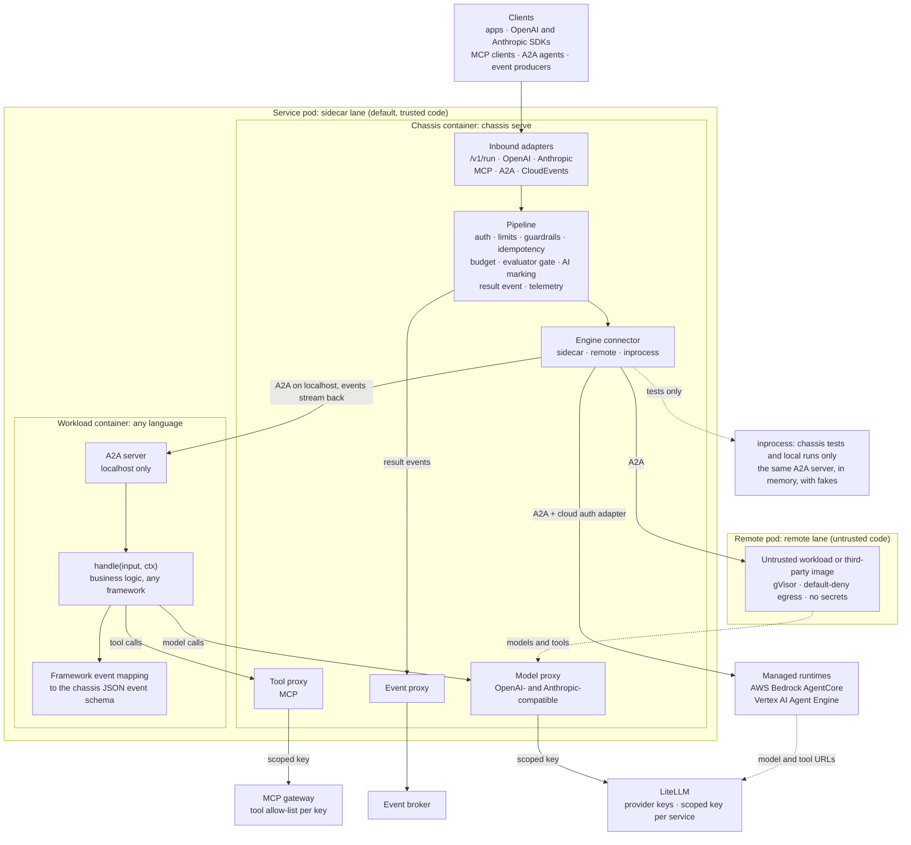
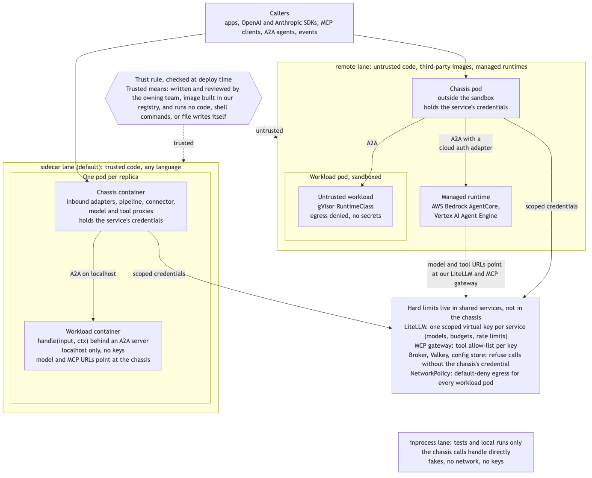

# Agent MVP: PoC iterations

A short track of proof-of-concept iterations that takes **the agent** to an MVP before the rest of the platform.
For: Oleksandr (epic owner) and the delivery team. Date: 2026-09-28.
Source: the [SLM agent platform epic](../slm-agent-platform-epic-v3.md). The full platform backlog is in [issues/](../issues/000-plan.md). It stays the long-term reference, and this track goes first.
Reuse first: the mature tech picks and how they connect are in [010-reuse-analysis.md](010-reuse-analysis.md).

## Goal

Build the agent server as a **service chassis**: one app that runs in front of whatever does the work, and is agnostic on every side. The agent is the chassis's first profile.

How the chassis runs next to the service's code is decided in [ADR-001](../adr/001-chassis-delivery-model.md). The chassis always runs in front, and every request passes through it. The workload plugs in behind it through one of three lanes: `sidecar` (the default), `remote`, or `inprocess` (tests only).

- **Agnostic to inputs.** Every protocol is an inbound adapter that maps to one canonical request: native `/v1/run`, OpenAI-compatible, Anthropic-compatible, MCP, A2A, and CloudEvents. Adding a protocol does not touch anything else.
- **Agnostic to what does the work.** Behind the chassis is an engine connector. The workload can be a Python framework or an agent in any other language, in its own container next to the chassis. It can also be untrusted code in a sandboxed pod, a managed runtime, or another team's service. In tests, it runs in the chassis's own process.
- **Agnostic to its own dependencies.** Every product the chassis uses sits behind a port with a fake (see "Swappable and testable from day 0").
- **Owner of every functional requirement.** Auth, limits, guardrails, idempotency, budgets, the evaluator gate, retry and fallback, AI marking, events, telemetry, feedback, and the registry manifest all run in the chassis's pipeline. They apply the same way in every lane. The hard limits (keys, budgets, tool allow-lists, network) live in shared services, so they hold even if the pipeline is bypassed.

Then use the chassis to compare agent SDKs, frameworks, and external solutions on the same tasks, and pick which to support.

## Agent MVP: done when

- [ ] The same chassis fronts three kinds of engine with no change to its core: a Python framework in the `sidecar` lane, an agent in another language in the `sidecar` lane, and a remote solution in the `remote` lane. In the chassis's tests, engines run `inprocess`, over A2A in memory.
- [ ] Business logic on at least three engines (plain Python and two frameworks) runs behind the chassis with no chassis changes: in the `sidecar` lane in the demo, and over A2A in memory in the chassis's tests.
- [ ] Every pipeline stage applies in every lane. What a remote solution does outside the chassis's reach is listed.
- [ ] Every engine answers through native, OpenAI, Anthropic, and MCP interfaces (and A2A if in scope), streaming and complete. One inbound contract suite shows that every interface maps to the same canonical request.
- [ ] The agent keeps no state: a repeated call with the same `idempotency_key` returns the same result, and a killed replica loses no request.
- [ ] Throughput grows with replicas under a load test.
- [ ] ADR-001 hard requirement 1: every internal service (LiteLLM, the MCP gateway, the broker, Valkey, the config store) refuses a call without the chassis's credential, and each pod may send traffic only to what its chassis needs. A `sidecar` workload holds no service account token, and cannot reach the cloud metadata service, the Kubernetes API, or the chassis's public port on localhost.
- [ ] ADR-001 hard requirement 2: every lane is tested on every commit. The contract suite runs each case over A2A on localhost and over A2A in memory, and CI runs a fake workload through the `remote` lane.
- [ ] A hostile workload in the `remote` lane cannot read secrets, reach the internet, write to disk, or call a tool that is not allow-listed.
- [ ] Every call has one trace: chassis stages, engine steps, model calls, and tool calls.
- [ ] Every outbound model and tool call is keyed to its inbound request, so two concurrent requests in one replica each get their own budget and route.
- [ ] Feedback on a call attaches to its trace.
- [ ] An eval suite runs in CI and blocks a regression; an online evaluator gate retries or falls back.
- [ ] Every external dependency sits behind a port with a fake, and each fake and real adapter passes that port's contract suite.
- [ ] The whole test suite runs offline with the `fake` profile: no network, no keys.
- [ ] One real component is swapped (for example LiteLLM for direct vLLM, or Dapr for a direct Kafka client) by config and a new adapter, with no change to business logic.
- [ ] `agentctl new` scaffolds a new agent with a chosen connector and engine that meets all of the above.

## The service chassis





The chassis has four layers. Only the inbound adapters and the connectors know about protocols and engines. The pipeline in the middle knows neither. The workload knows only `handle`, A2A, and the chassis's model and tool URLs.

### Inbound adapters: agnostic to inputs

| Adapter | Protocol | Reuse |
| ------- | -------- | ----- |
| Native | `POST /v1/run`, server-sent events | FastAPI |
| OpenAI-compatible | `POST /v1/chat/completions` | Request and response types from the official `openai` Python SDK |
| Anthropic-compatible | `POST /v1/messages` | Request and response types from the official `anthropic` Python SDK |
| MCP | Tools generated from the OpenAPI spec | FastMCP 4 |
| A2A | JSON-RPC, signed agent card | a2a-sdk 1.x |
| Events | CloudEvents | A Dapr subscription, or the in-memory bus in tests |

Each adapter only translates. The inbound contract suite sends the same logical request through every adapter. It checks that the pipeline sees the same canonical request, and that the answer maps back correctly in each format. FastAPI hosts the HTTP adapters, but the pipeline and the connectors import no web framework, so the same core can run behind another server.

LiteLLM is no longer needed in front of the chassis to serve the Anthropic format. It can still be added as an optional front door, for example for per-caller virtual keys, but the chassis does not depend on it.

### Pipeline: every functional requirement, once

Each stage is a module switched on in config (`spec.modules`), so an agent gets only what it needs, as in the epic's agent factory (B.5).

| Stage | Functional requirement | Port | Backlog issue |
| ----- | ---------------------- | ---- | ------------- |
| Auth and scopes | Callers verified; least privilege | `AuthPort` | [022 H-6](../issues/022-H-6-security-middleware.md) |
| Limits | Rate and input size | `StatePort` | [022 H-6](../issues/022-H-6-security-middleware.md) |
| Input guardrails | PII redaction; prompt-injection check | `GuardrailPort` | [022 H-6](../issues/022-H-6-security-middleware.md) |
| Idempotency | Same key, same result, no repeated side effects | `StatePort` | [018 H-18](../issues/018-H-18-idempotency.md) |
| Config and version pin | Config loaded and checked; versions reported | `ConfigPort` | [010 H-12](../issues/010-H-12-config-loader.md) |
| Budget and timeout | Tokens, cost, and time per call | Counts from the model proxy | [017 H-4](../issues/017-H-4-harness-features.md), [013 CH-2](../issues/013-CH-2-outbound-model-proxy.md) |
| History swap | Long past answers replaced by short versions | `StorePort`, `ModelPort` | [044 G-4](../issues/044-G-4-history-swap.md) |
| Engine call | The business logic runs in the workload, reached through the lane's connector | `EnginePort` (a connector) | [008 H-14](../issues/008-H-14-one-agent-interface.md), [009 CH-1](../issues/009-CH-1-engine-connectors-a2a.md) |
| Output schema check | Output matches its schema | — | [017 H-4](../issues/017-H-4-harness-features.md) |
| Evaluator gate, retry, fallback | Low scores retried, then the fallback route | `EvaluatorPort`, `ModelPort` | [017 H-4](../issues/017-H-4-harness-features.md), [042 A-2](../issues/042-A-2-evaluator-gate-fallback.md) |
| Output guardrails and AI marking | PII check; `ai_generated` flag | `GuardrailPort` | [022 H-6](../issues/022-H-6-security-middleware.md), [023 C-5](../issues/023-C-5-ai-generated-marking.md) |
| Result event | One-way CloudEvent | `EventPort` | [019 H-17](../issues/019-H-17-event-port.md) |
| Telemetry | Spans, logs, and metrics on every stage | `TelemetryPort` | [014 H-7](../issues/014-H-7-observability.md) |
| Side endpoints | `/v1/feedback`, `/manifest`, `/health`, `/ready`, `/metrics` | `FeedbackPort`, `RegistryPort` | [011 H-2](../issues/011-H-2-inbound-adapters.md), [051 H-13](../issues/051-H-13-openapi-mcp-tools.md) |
| Service operations | The service's own operations, declared in `spec.operations`, enter through the chassis and pass the same pipeline | `EnginePort` | [050 CH-5](../issues/050-CH-5-service-operations.md) |

### Engine connectors: agnostic to what does the work

The connector is the lane, picked by `spec.engine.connector`.

| Lane | What sits behind | How the chassis talks to it | What the chassis controls |
| ---- | ---------------- | --------------------------- | ------------------------- |
| `sidecar` (default) | Trusted code in any language, in its own container in the same pod: plain Python, a Python framework, or an agent in TypeScript, Java, Go, … | A2A on localhost. The workload serves `handle` through the template A2A server, or serves A2A itself | Everything. The workload holds no key, and its model and MCP URLs point at the chassis. Internal services refuse it without the chassis's credential |
| `remote` | Untrusted code (see the trust rule below), third-party images, managed runtimes (AWS Bedrock AgentCore, Vertex AI Agent Engine), and other teams' services | A2A, with a cloud auth adapter for a managed runtime. OpenAI-compatible HTTP only for a workload that cannot speak A2A | Inputs and outputs only. The workload runs in its own gVisor pod with default-deny egress, or at its own endpoint. Its model and tool calls go through the chassis's proxies over the network, with a per-remote credential. A managed runtime that cannot be pointed at the proxies holds its own scoped key: the one relaxation of hard requirement 1. What is outside the chassis's reach is listed per remote: at least the remote's own internal steps and calls |
| `inprocess` | The template A2A server, loaded in the chassis's own process | A2A in memory (an ASGI transport, no socket), with fakes | The chassis's own tests and local runs only: no network, no keys, one debugger. A workload's own tests run the chassis as a separate process in the `fake` profile instead, so the workload never installs the chassis package |

**The trust rule** ([ADR-001](../adr/001-chassis-delivery-model.md), item 5) decides what goes to `remote`. A workload is trusted only if both tests pass:

- **Source:** the owning team wrote and reviewed it, and its image is built in our registry.
- **Behavior:** it does not run code, shell commands, or file writes itself.

Everything else is untrusted. The agent config declares `spec.trust: trusted | untrusted`, and an admission check blocks an untrusted workload in the `sidecar` lane. Generated code that runs through the code-execution tool behind `ToolPort` does not make an agent untrusted.

### Outbound proxies: the same controls for every engine

The chassis gives every workload an OpenAI- and Anthropic-compatible model endpoint and an MCP tool endpoint. The workload points its model base URL and its MCP client at them, and holds no key. The proxies are thin: they count, trace, and apply per-call budgets. They key each outbound call to its inbound request by `traceparent`, which the workload's HTTP client propagates (suggested: OpenTelemetry httpx instrumentation in the workload), so concurrent requests in one replica keep separate budgets and routes. Then they add the service's scoped key and send the call on through its port: to LiteLLM for models, and to the MCP gateway for tools. Result events go out through the chassis's `EventPort` to the broker.

The hard limits live in those shared services, not in the chassis. Each service has one scoped LiteLLM key (models, budgets, rate limits), and the MCP gateway holds a tool allow-list per key. So the limits hold even if the chassis's pipeline is bypassed. That is how an agent written in TypeScript gets the same controls as one in Python.

### The contracts

```python
class InboundAdapter(Protocol):
    protocol: str   # native | openai | anthropic | mcp | a2a | cloudevents

    def to_request(self, raw: Any, headers: Mapping[str, str]) -> CanonicalRequest: ...
    def from_events(self, events: AsyncIterator[Event], stream: bool) -> Any: ...


# What a service implements. It runs in the workload, not in the chassis.
# It yields events in the chassis JSON event schema: start, delta, tool_call, metrics, end, error.
async def handle(input: TaskInput, ctx: Context) -> AsyncIterator[Event]: ...


class EngineConnector(Protocol):
    kind: Literal["inprocess", "sidecar", "remote"]   # the lane, from spec.engine.connector
    capabilities: set[str]   # streaming, tools, structured_output, code_exec, multi_agent

    async def setup(self, config: AgentConfig, ports: Ports) -> None: ...
    def run(self, request: CanonicalRequest, ctx: Context) -> AsyncIterator[Event]: ...
    async def close(self) -> None: ...
```

`handle` is always served by the template A2A server, so there is one wire contract. Only the transport differs: A2A on localhost in `sidecar`, over the network in `remote`, and in memory in `inprocess`. The framework event mapping lives in the workload, next to `handle`, not in the chassis. It turns the framework's token deltas, tool calls, and usage into chassis events. The chassis imports no framework. The service template ships one mapping per supported framework, and a contract test checks each one.

## Swappable and testable from day 0

Every pick in the reuse analysis must be replaceable at any time, and every dependency must be mockable in development. The chassis gets this from five rules:

1. **Talk to standards, not products.** Models over OpenAI-compatible HTTP, tools over MCP, events as CloudEvents, telemetry as OpenTelemetry, config over the S3 API, and callers through OIDC. Swapping a product that speaks the same standard is a config change.
2. **One port per external dependency.** Each port has an interface, a fake, and one or more real adapters. Business logic and the chassis core only see ports.
3. **One contract suite per port.** The same tests run against the fake and against every real adapter. This keeps fakes honest: a fake that passes the suite behaves like the real thing.
4. **Adapters are picked by config.** `spec.adapters` in the agent config names the adapter per port, and profiles set them all at once: `fake` (no network, no keys), `local` (Docker Compose), and `cloud`. This block is an addition to the epic's config schema.
5. **No product SDK outside its adapter.** An import-lint rule in CI enforces it, the same rule that keeps framework code out of the chassis.

| Port | Real adapter (default) | Fake for development and tests | Can be swapped for |
| ---- | ---------------------- | ------------------------------ | ------------------ |
| `ModelPort` | LiteLLM over OpenAI-compatible HTTP | A scripted fake model server (OpenAI-compatible, with streaming and tool calls), plus record and replay | Any OpenAI-compatible gateway, vLLM or llama.cpp directly, provider APIs |
| `EnginePort` (engine connector) | `sidecar` (A2A on localhost, the default), `remote` (A2A with a cloud auth adapter; OpenAI-compatible only for a workload that cannot speak A2A), `inprocess` (A2A in memory, for the chassis's tests and local runs) | A scripted fake engine that emits a fixed event stream | Any framework, any language, any remote solution |
| `ToolPort` | MCP through the LiteLLM MCP gateway | In-memory fake tools | Direct MCP, REST tools, agentgateway |
| `EventPort` (in and out) | Dapr pub/sub | In-memory event bus | A direct Kafka or NATS client, SQS, Pub/Sub |
| `StatePort` (idempotency, cache) | Valkey | In-memory store | Redis, Dapr state, Postgres |
| `ConfigPort` | MinIO, S3, or GCS | A local file or in-memory config | Any S3-compatible store, Git |
| `TelemetryPort` | OpenTelemetry SDK → OTel Collector → Langfuse, Tempo | In-memory span exporter (tests assert on spans) | Any OpenTelemetry backend, by exporter config |
| `FeedbackPort` | Langfuse scores API | In-memory store | Another trace backend, a Postgres table, events only |
| `EvaluatorPort` | Evaluator agent (LLM judge, later the encoder SLM) | Fixed-score fake | Any judge model, promptfoo or DeepEval scorers |
| `GuardrailPort` | LiteLLM guardrails (Presidio, Llama Prompt Guard 2) | Pass-through or rule-based fake | Presidio in-process, NeMo Guardrails, Guardrails AI |
| `AuthPort` (verify callers) | OIDC JWT verifier | Static test tokens | API keys, another IdP |
| `RegistryPort` | Platform registry API | In-memory registry | ToolHive, AWS Agent Registry |
| `StorePort` (data agents only) | Postgres | SQLite or in-memory | Another SQL store |
| Durable runs (orchestrator only) | Temporal | Temporal's time-skipping test environment | Dapr Workflows, LangGraph checkpoints |

Frameworks call models over HTTP with their own clients, so a Python mock cannot intercept them. The fake model server is how every engine is tested offline: it stands where LiteLLM would, behind the chassis model proxy.

Test layers, all mature Python tools:

| Layer | What it checks | Tools | Runs |
| ----- | -------------- | ----- | ---- |
| Unit | Core, adapters, and business logic with fakes | pytest, pytest-asyncio | Every commit, offline, in seconds |
| Port contract | Fakes and real adapters behave the same | One pytest suite per port | Every commit (fakes), nightly and on adapter change (real) |
| Inbound contract | Every protocol maps to the same canonical request, and back | One pytest suite over all inbound adapters | Every commit, offline |
| Lane contract | Every case gives the same result over A2A on localhost and over A2A in memory; a fake workload runs through `remote` | One pytest suite, run over both transports, and a fake remote workload | Every commit (ADR-001 hard requirement 2) |
| Component | The whole chassis in-process, every interface, fake adapters | httpx ASGI transport, respx, the fake model server | Every commit, offline |
| API contract | OpenAPI and AsyncAPI specs hold | Schemathesis (property tests from OpenAPI) | Every commit |
| Record and replay | Real model and tool traffic replayed | vcrpy or pytest-recording | Every commit, offline |
| Integration | Real dependencies in containers | testcontainers (Valkey, Postgres, Kafka, MinIO), Temporal test environment | Every merge |
| End to end | The Docker Compose stack, `local` profile | pytest against the running stack | Every merge, nightly |
| Evals | Quality on the golden set | promptfoo or DeepEval | Every merge that touches business logic, prompts, or models |

**Day 0** means the repo, CI, the four ports the walking skeleton uses (`ModelPort`, `EnginePort`, `ConfigPort`, `TelemetryPort`) with their fakes and contract suites, the fake model server, and `make test` exist before the first feature. The other ports are defined in the same shape by the iteration that adds their first adapter, so each contract is shaped by a real adapter, not guessed. From then on, `make test` passes with no network and no keys.

## Principles for this track

- **Swappable and testable from day 0.** Ports, fakes, and contract suites come first, before features. See the section above.
- **Reuse before build.** Only the chassis's inbound adapters, pipeline, engine connectors, and outbound proxies are ours, plus the template A2A server and the framework event mappings. Everything else is a mature component from the reuse analysis.
- **A thin slice every iteration.** Each iteration ends with a demo and answers one question.
- **The code is kept, not thrown away.** PoC code becomes the chassis, but it is hardened only as far as the iteration's exit criteria. So this track is an incremental MVP build with a go/no-go gate per iteration, not throwaway proof-of-concept code, and it is reviewed to that standard.
- **Frameworks stay in the workload.** The chassis imports none. A framework's types and its event mapping live in the workload, next to `handle`.
- **Every model call goes through the chassis model proxy.** Each framework's base URL points at the chassis model proxy, which forwards the call to LiteLLM with the service's scoped key. That gives one place for tokens, cost, and model swaps, whatever the framework.
- **Every functional requirement lives in the chassis pipeline**, never in the engine. PoC-7 confirms it for every lane, and the backlog's chassis waves are updated with the result.
- **Hard limits live outside the chassis:** in LiteLLM, the MCP gateway, and network policy. The pipeline is not the security boundary against hostile code.
- **Local first.** Docker Compose, plus a rented GPU if a local model is needed. Kubernetes only where a check needs it: PoC-5 (gVisor, network policy, and the admission check, on a kind cluster) and, optionally, PoC-9.

## Iterations

| # | Iteration | Question it answers | Time box |
| - | --------- | ------------------- | -------- |
| 1 | [Walking skeleton](001-PoC-1-walking-skeleton.md) | Is the chassis testable offline from day 0? Does one request go end to end? | 1 week |
| 2 | [Two engines, one contract, two lanes](002-PoC-2-two-engines-one-contract.md) | Can two very different frameworks run as workloads behind one `handle` contract, over A2A on localhost and in memory, with no framework code in the chassis? Does a TypeScript echo pass the same contract? | 2 weeks |
| 3 | [One interface for every client](003-PoC-3-one-interface-every-client.md) | Can any client call any engine the same way? | 1 week |
| 4 | [Stateless and scalable](004-PoC-4-stateless-scalable.md) | Does it scale by adding replicas, with no state and safe retries? What does the sidecar cost per replica? Dapr or a broker client? | 1 week |
| 5 | [Sandboxed: the remote lane and the trust rule](005-PoC-5-sandboxed.md) | Can untrusted code run in the `remote` lane without reaching secrets, the internet, the disk, or tools it is not allowed? Does only the chassis reach internal services? | 3 weeks |
| 6a | [Framework bake-off, part A: the `sidecar` lane](006-PoC-6-framework-bake-off.md) | Which trusted frameworks should the platform support, and which is the default? | 1 week |
| 6b | [Framework bake-off, part B: the `remote` lane](006-PoC-6-framework-bake-off.md) | Which untrusted frameworks and which remote solution does the chassis front, with no change to its core? | 1 week |
| 7 | [Confirm the cross-cutting stack](007-PoC-7-cross-cutting-decisions.md) | Does the chosen stack give security, observability, feedback, and evals to every engine, with no engine-specific code? | 2–3 weeks |
| 8 | [Build in the cross-cutting concerns](008-PoC-8-build-cross-cutting.md) | Do the chosen designs work end to end on every engine? | 3–5 days |
| 9 | [Agent MVP: template and factory](009-PoC-9-agent-mvp-template.md) | Can a new agent with any business logic be scaffolded and running in under a day? | 1 week |

About 13–15 weeks for one engineer. An earlier draft said 8.5–10.5. The review of 2026-09-29 raised PoC-5 to 3 weeks (cluster plumbing: kind, a CNI that enforces NetworkPolicy, gVisor, agent-sandbox, Kyverno, and two hostile suites), PoC-7 to 2–3 weeks (four new ports with real adapters, two tool comparisons, a red-team set, and four ADRs), PoC-2 to 2 weeks (the TypeScript echo and the per-token measurements), and PoC-4 to 1 week (the Dapr decision and the pod lifecycle checks). The reuse picks and ADR-001 are already in these numbers. The time boxes are suggestions; change them per iteration.

Order: 1 → 2 → 3. Then 4, 5, and 6a can run in parallel, because 6a needs only 3. 6b needs 5, because its frameworks run in the `remote` lane. 7 needs 6a and 6b. Then 8, then 9. With one engineer, 6a fits between 4 and 5, or while the cluster work in 5 waits on something.

## Framework shortlist

Pick 4–5 for the bake-off. Each one covers a different kind of agent.

| Kind | Candidate | Why test it |
| ---- | --------- | ----------- |
| Baseline | Plain Python, no framework | The control group. Every framework's overhead is measured against it |
| Typed and light | PydanticAI | Small and typed, with OpenTelemetry built in |
| Graph or state machine | LangGraph | Explicit state and checkpoints, the closest fit to the epic's orchestrator |
| SDK agent loop | OpenAI Agents SDK | Handoffs, guardrails, tracing hooks; works with any OpenAI-compatible endpoint |
| Full agent runtime | Claude Agent SDK | Built-in tools (files, shell) and hooks. With its shell and file tools on, it fails the trust rule and runs in the `remote` lane |
| Code agent | smolagents | The agent writes and runs code itself, so it runs in the `remote` lane |
| Optional | Google ADK, Microsoft Agent Framework, Strands Agents, CrewAI | Only if the team has a reason to use one |

PoC-2 uses plain Python, PydanticAI, and LangGraph as workloads in the `sidecar` lane, plus a TypeScript echo workload that proves the contract carries nothing Python-specific. PoC-6a adds the rest of the trusted shortlist and grows the TypeScript echo into a full agent. PoC-6b adds the `remote`-lane frameworks and one remote solution.

## Bake-off criteria

Each engine gets the same two tasks: text in, text out (the simplifier), and a tool task (lookup with two tools). Each runs on a big model and on an SLM through the router.

| Criterion | How it is measured |
| --------- | ------------------ |
| Event mapping effort | Lines of code and days to map the framework's events to the chassis event schema |
| Streaming fidelity | Over A2A: are token deltas and tool-call events streamed, or only the final answer? Overhead per streamed delta and time to first token, against plain Python |
| Tool support | Native tool calls, JSON with guided decoding, or neither |
| Model agnostic | Works through the chassis model proxy and LiteLLM with a big model and an SLM on vLLM or llama.cpp |
| Token overhead | Extra tokens per call from the framework's own prompts, vs plain Python |
| Latency | p50 and p95 per call, and cold start |
| Footprint | Image size and memory per replica |
| Statelessness | Does it keep hidden state (sessions, memory, files)? Can that be moved out? |
| Lane under the trust rule | Passes it (`sidecar`), or needs `remote`: the subprocesses, shell commands, file writes, and network the framework needs |
| Observability hooks | An OpenInference instrumentor exists, or native OpenTelemetry |
| Durability | A Temporal integration exists (OpenAI Agents SDK GA; PydanticAI and LangGraph supported) |
| License and maturity | License, release pace, breaking changes in the last year |

## Cross-cutting concerns: chosen stack

These are the picks from the [reuse analysis](010-reuse-analysis.md). PoC-7 confirms them on two engines and records each one in an ADR.

- **Observability:** OpenTelemetry with OpenInference instrumentors, which cover every shortlisted framework. Spans go from the chassis boundary, the workload, LiteLLM, and the tool proxy through an OTel Collector to Langfuse v4. Prometheus, Grafana, Loki, and Tempo cover the rest. Framework spans join the same trace through `traceparent`, passed over A2A.
- **Security:** four layers, all outside the business logic. The chassis's own redaction of logs and events is regex only, so the chassis stays small; named-entity redaction runs in LiteLLM and the OpenTelemetry Collector. Inbound: OAuth2/OIDC from the company IdP, scopes, and rate and size limits. Content: Presidio PII redaction and Llama Prompt Guard 2, run as LiteLLM guardrails on inputs, outputs, and tool outputs. Execution: the trust rule and the lanes, gVisor for `remote` workload pods, default-deny network policy, and one scoped LiteLLM key and MCP tool allow-list per service, held by the chassis. Outbound: AI-generated marking. Snyk Agent Scan runs in CI.
- **Feedback:** `POST /v1/feedback` with `request_id`, a score, a label, and a comment. It is stored through the Langfuse scores API on the call's trace, and published as an event for the golden set. Implicit signals count too: fallbacks, retries, and evaluator scores.
- **Evals:** offline, promptfoo (or DeepEval) in CI on the golden set, running the same cases on every engine, with Langfuse datasets and experiments. Online, the evaluator gate in the chassis, which retries or falls back.

Security follows [ADR-001](../adr/001-chassis-delivery-model.md). The trust rule picks the lane. Trusted code runs in the `sidecar` lane. Everything else runs in the `remote` lane, in its own gVisor pod with default-deny egress, or at its own endpoint. Hostile code never shares the chassis's process or pod. The chassis's pipeline runs in every lane, but it is not the security boundary against hostile code. The hard limits live outside the chassis, in shared services: the scoped LiteLLM key, the MCP gateway's allow-list, and network policy. Every internal service refuses a call without the chassis's credential, so a workload that goes around the chassis gets nowhere. The pod itself is closed too: no service account token in the workload, no route to the metadata service or the Kubernetes API, and the chassis's public port off localhost. PoC-5 proves this in both lanes.

## Risks

| Risk | Mitigation |
| ---- | ---------- |
| A framework keeps state in the process (sessions, memory) | Statelessness is a bake-off criterion; move the state out or reject the framework |
| A heavy runtime (for example Claude Agent SDK's subprocess and file tools) does not fit the `sidecar` lane | It runs in the `remote` lane. PoC-5 builds the lane, and PoC-6 runs the framework there |
| The sidecar costs more than ADR-001 estimates (suggested: 0.05–0.1 vCPU, 128–256 MiB, and a 1–3 ms hop per replica) | PoC-4 measures the hop latency, CPU, and memory per replica. If they are far above, the ADR's Revisit rule applies: allow `inprocess` in production for small, trusted Python services |
| The two transports drift: a bug hides in the gap between A2A on localhost and A2A in memory, or the `remote` lane breaks unnoticed | The lane contract suite runs every case over both transports, and a fake workload through `remote`, on every commit (hard requirement 2) |
| The A2A hop costs too much per token: every delta is one A2A event, parsed on both sides | PoC-2 measures the overhead per delta and the time to first token. If far above the estimate (suggested: 0.5 ms per delta), ADR-001's Revisit rule swaps the localhost transport for plain HTTP and NDJSON of chassis events |
| A framework's model client drops the `traceparent` header, so the proxy cannot key its calls to the request | Correlation is a PoC-2 exit criterion per engine. Calls without a trace id count against a per-replica budget and are logged |
| Framework prompt overhead eats the savings from small models | Token overhead is measured against plain Python |
| Framework releases break event mappings | Pin versions; the contract tests run on every upgrade |
| A reused component ships a bad release (LiteLLM had malicious PyPI releases in March 2026) | Pin every dependency by hash; upgrade on purpose, not automatically |
| A framework needs provider-only features (for example Responses API, prompt caching) that the chassis model proxy or the router does not pass through | Test router compatibility per engine in PoC-2 and PoC-6 |

## Decisions for the epic owner

- The delivery model is decided: [ADR-001](../adr/001-chassis-delivery-model.md), option I5, with the `sidecar` lane as the default.
- Accept or replace the reuse picks (tracked in backlog issue [001 DEC-1](../issues/001-DEC-1-resolve-open-decisions.md)).
- Final framework shortlist for PoC-6.
- How many untrusted workloads the MVP must run in the `remote` lane, beyond the fake one.
- Whether PoC-9 also runs on Kubernetes (kind or k3d), or stays on Docker Compose. PoC-5 already needs a kind cluster.
- Dapr, or a broker client in the chassis behind `EventPort`. PoC-4 tries both and recommends one. suggested: the broker client, because Dapr is a third container in every pod, with its own localhost API to close and its own release train.
- The evaluator gate's cost: a big-model judge on every call until the encoder SLM lands. A sample rate, asynchronous scoring, or both. Open until PoC-7 reports numbers (marked as an open concern in 017 H-4, 042 A-2, 031 G-5, 073 E-1, and 075 E-3).

## After the MVP

- Update the chassis waves of the backlog (W2 and W5 in [issues/000-plan.md](../issues/000-plan.md)) with the PoC results and the ADRs from PoC-6 and PoC-7.
- The connectors, the proxies, the library chart, and the `remote` lane are now backlog issues CH-1 to CH-8: [009 CH-1](../issues/009-CH-1-engine-connectors-a2a.md), [013 CH-2](../issues/013-CH-2-outbound-model-proxy.md), [024 CH-3](../issues/024-CH-3-helm-library-chart.md), [026 CH-4](../issues/026-CH-4-chassis-only-credentials-egress.md), [050 CH-5](../issues/050-CH-5-service-operations.md), [055 CH-6](../issues/055-CH-6-remote-lane-trust-rule.md), [056 CH-7](../issues/056-CH-7-chassis-release-rings.md), and [058 CH-8](../issues/058-CH-8-framework-event-mappings.md). Update them with the PoC results.
- Then continue the backlog from the router and SLM waves, with the MVP chassis as the base.
