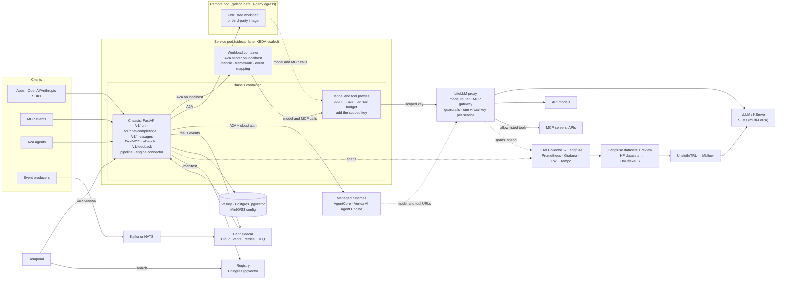

# Reuse analysis: mature tech for the agent platform

What to reuse instead of build, one pick per component, and how the pieces connect.
For: Oleksandr (epic owner) and the delivery team. Checked against primary sources on 2026-09-28. Re-check versions before adopting.

## The answer in short

- **No product does the whole service chassis and runs self-hosted.** Managed runtimes come close: AWS Bedrock AgentCore, Azure Foundry hosted agents, and Google Agent Runtime. All three tie the platform to one cloud, which breaks the epic's "no lock-in, same stack everywhere" principle. The open-source equivalent, kagent 1.x, is still alpha and runs on Kubernetes only.
- **So: build a thin chassis and assemble the rest.** The only part nobody offers is the **engine connector**, the piece that runs any workload behind one contract. Everything around it is mature open source.
- **Reach the managed runtimes; do not host on them.** [ADR-001](../adr/001-chassis-delivery-model.md), item 8: agents on AWS Bedrock AgentCore or Vertex AI Agent Engine are called through the `remote` lane over A2A, with a small cloud auth adapter. The chassis stays in our cluster. So the agent container does not need AgentCore's `/invocations` and `/ping` contract.
- **Effect:** the PoC track goes from about 9–11 weeks to about 7–9. The backlog sizes drop from about 305 to about 260 engineer-days (see [../issues/000-plan.md](../issues/000-plan.md#estimate-check)).

## Components and picks

"Maturity" says how safe the pick is to depend on. Items marked "new" work, but they had a major release in 2026, so pin versions.

| Component | Mature tech to use | Maturity | How it connects |
| --------- | ------------------ | -------- | --------------- |
| Service chassis | Python 3.12, FastAPI, Pydantic. **Build** the thin chassis: one `chassis` package and one generic image (`chassis serve`), with the engine connectors (`inprocess`, `sidecar`, `remote`) and the outbound proxies | Mature stack | Receives every call: from clients, LiteLLM, MCP, A2A, and Dapr. Calls the workload through the connector. Its model and tool proxies send every call on to LiteLLM and the MCP gateway, with the service's scoped key |
| Business logic engines | Plain Python, PydanticAI, LangGraph, OpenAI Agents SDK, Claude Agent SDK (picked in the PoC-6 bake-off) | Mature, fast-moving | Run in the workload container next to the chassis, or in the `remote` lane, always behind the chassis. Each framework's model base URL points at the chassis model proxy |
| Model gateway | LiteLLM proxy | Widely used. Pin by hash | The chassis's model proxy sends every model call to LiteLLM with the service's scoped virtual key, and LiteLLM routes it to vLLM or API models. Its MCP gateway enforces a tool allow-list per key, and its guardrails run Presidio and Prompt Guard. Optional front door for per-caller virtual keys; the chassis owns every input protocol itself |
| MCP and A2A interfaces | FastMCP 4 (MCP tools from the OpenAPI spec) and the official a2a-sdk 1.x | Mature projects, new major versions | Mounted in the chassis. LiteLLM federates them behind one URL, with access control. The a2a-sdk is also the contract between the chassis and its workloads |
| Model serving | vLLM (multi-LoRA, guided decoding); KServe on Kubernetes for canary rollout | Mature | Sits behind named LiteLLM routes. A new SLM goes live by changing the route |
| Events | Dapr sidecar (pub/sub, CloudEvents envelope, retries, dead-letter topics) with Kafka, or NATS JetStream | Dapr CNCF graduated; its NATS component is beta | Producer → broker → Dapr → the chassis's event route. Result events → broker → recorder and audit log |
| Durable runs (orchestrator) | Temporal, plus its integration for the chosen engine (OpenAI Agents SDK GA; PydanticAI and LangGraph supported) | Mature | Holds run state and checkpoints. Agent pools pull steps from Temporal task queues |
| Autoscaling | KEDA (Kafka or NATS lag scalers, Temporal task-queue scaler) | CNCF graduated | Scales agent Deployments on queue depth, down to zero when idle |
| Sandbox | gVisor through `kubernetes-sigs/agent-sandbox` on Kubernetes; hardened Docker with no network locally; E2B (Firecracker) only if agents run generated code | gVisor mature; agent-sandbox new (v1.0) | Wraps each `remote` workload pod, not every agent pod. The chassis pod stays outside the sandbox. Generated code runs through the code-execution tool behind `ToolPort` |
| Egress and secrets | Default-deny network policy; Vault with External Secrets; Envoy as an optional egress proxy (domain allow-list, credential injection) for other allow-listed hosts | Mature | Workloads reach models and tools only through the chassis proxies, and the chassis adds the scoped key. Secrets are mounted in the chassis container only, never in the workload |
| Auth and cluster policy | OAuth2/OIDC from the company IdP; LiteLLM virtual keys, one per service, held by the chassis; cert-manager (mTLS); Kyverno and cosign (signed images) | Mature | At the front door and in the cluster. Kyverno also runs the admission check for `spec.trust` |
| PII and prompt injection | Microsoft Presidio; Llama Prompt Guard 2; both run as LiteLLM guardrails | Mature; Prompt Guard reads 512 tokens at a time | Before and after model calls, before MCP tool calls, and on tool outputs |
| Observability | OpenTelemetry with OpenInference instrumentors → OTel Collector → Langfuse v4 for LLM traces; Prometheus, Grafana, Loki, Tempo for the rest | Mature; the GenAI conventions are not stable yet | Spans from the chassis, every workload, LiteLLM, and tool calls join one trace through `traceparent`, passed over A2A |
| Feedback | Langfuse scores API, behind the chassis's `POST /v1/feedback` | Mature | Linked to the call's `trace_id`, then flows to the golden set |
| Evals | promptfoo (or DeepEval) in CI; Langfuse datasets and experiments; the online evaluator gate in the chassis | Mature | CI blocks a merge on a golden-set regression. The online gate scores each call, then retries or falls back |
| Config store | MinIO locally, S3 or GCS in the cloud; YAML checked by JSON Schema | Mature | The chassis's config loader reads and reloads it |
| State and records | Valkey (idempotency cache); Postgres 17 with pgvector on CloudNativePG (records, registry, memory) | Mature | Used by the chassis, the recorder, the registry, and the orchestrator |
| Golden set and review | Langfuse datasets and annotation queues (Label Studio if richer edit screens or strict roles are needed); HF datasets for export; DVC, or lakeFS (now under a Business Source License) for versions | Mature | Recorder → Langfuse review → versioned export → training |
| Training and model lifecycle | Unsloth core (Apache 2.0) or TRL; MLflow 3; vLLM batch jobs with an open-weight teacher for synthetic data | Mature | Golden set → LoRA training → MLflow gate → vLLM or KServe canary → LiteLLM route switch |
| Service registry | Postgres + pgvector, using the MCP Registry `server.json` format and A2A agent cards; a kopf controller; Qwen3 embedding and reranker models on vLLM. Evaluate ToolHive Registry Server as a base | Formats mature; ToolHive is pre-1.0 | Reads each agent's `/manifest` on deploy. The orchestrator searches it. It is exposed as MCP through FastMCP |
| Tool-description scanning | Snyk Agent Scan in CI, run in a sandbox; Prompt Guard on descriptions at registration | Mature vendor | Runs at registry registration and in CI |
| Deploy | Docker Compose, Kubernetes (native sidecars), Helm, Argo CD, Terraform | Mature | Same images everywhere. Every service's chart includes the shared Helm library chart, which adds the chassis sidecar with a pinned tag. Terraform for AWS and GCP |
| Governance evidence | Governance block in config; audit log on S3 Object Lock; HF model cards and CycloneDX ML-BOM; Vanta or Drata for the ISO 42001 audit | Mature | Built from registry, audit log, and MLflow data. The audit tool takes the export |

## How it connects

Read it as three paths:

1. **Request path:** client → chassis (inbound adapter, then the pipeline: auth, limits, guardrails, idempotency, budget) → engine connector → workload. In the `sidecar` lane the workload is the second container in the pod, reached over A2A on localhost. In the `remote` lane it is a sandboxed pod or a managed runtime, reached over A2A. Events take the other door: broker → Dapr → chassis.
2. **Outbound path:** workload → chassis model and tool proxies → LiteLLM for models (vLLM or API) and the MCP gateway for allow-listed tools, with the service's scoped key. The workload holds no key. Nothing else is reachable from the pod: network policy allows only what the chassis needs, and each of those services refuses a call without the chassis's credential.
3. **Learning path:** spans and feedback → Langfuse → golden set review → versioned export → training → MLflow gate → vLLM → a LiteLLM route switch.

## Keeping every pick swappable

Every pick above can be replaced later, because the chassis never calls a product directly:

- **Standards on the wire.** Models are called over OpenAI-compatible HTTP, tools over MCP, events as CloudEvents, telemetry as OpenTelemetry, config over the S3 API, and callers through OIDC. Swapping in a product that speaks the same standard (another LLM gateway, another OTel backend, another S3 store) is a config change.
- **A port and a fake for each dependency.** Swapping a product that speaks a different protocol (for example Dapr for a direct Kafka client) means writing one adapter that passes the port's existing contract suite. Business logic does not change.
- **Fakes from day 0.** Every port has an in-memory fake, and there is a fake OpenAI-compatible model server, so development and CI run with no network and no keys.

The port-by-port table (real adapter, fake, and alternatives) and the test layers are in [000-plan.md](000-plan.md#swappable-and-testable-from-day-0).

Test tooling, all mature: pytest, pytest-asyncio, the httpx ASGI transport, respx, vcrpy or pytest-recording, testcontainers, Schemathesis, Temporal's test environment, the OpenTelemetry in-memory span exporter, and promptfoo or DeepEval.

## Where the managed runtimes fit

Managed runtimes are reached, not hosted ([ADR-001](../adr/001-chassis-delivery-model.md), item 8). The chassis stays in our cluster, in front. It calls an agent on a managed runtime through the `remote` lane over A2A, with a small auth adapter per cloud. The configuration store points that agent's model and tool URLs at our LiteLLM and MCP gateway.

| Runtime | Covers | How the chassis reaches it | Limits |
| ------- | ------ | -------------------------- | ------ |
| AWS Bedrock AgentCore | Runtime (microVM per session), Gateway, Identity, Memory, Observability, Policy, Evaluations, Agent Registry (all GA in 2026) | `remote` lane over A2A, which it supports natively. Auth: SigV4 or OAuth 2.0 | AWS only. Use it if the first cloud is AWS and lock-in is accepted |
| Azure Foundry hosted agents | Bring-your-own container, VM-isolated sessions, Responses API, A2A | `remote` lane over A2A | Azure only; sandboxes max 2 vCPU / 4 GiB |
| Google Agent Runtime (was Vertex AI Agent Engine) | ADK in full; LangChain, LangGraph, AG2, and LlamaIndex through its SDK; custom containers | `remote` lane over A2A, which it supports natively. Auth: Google auth | GCP only |
| kagent 1.x (CNCF Sandbox) | Agents as Kubernetes resources, MCP and A2A, gVisor or microVM sandboxes | `remote` lane over A2A, as a workload in our cluster | 1.0 is still alpha; Kubernetes only, no Docker Compose |

## Avoid

- **TensorZero:** archived on 2026-06-12.
- **Argilla:** in maintenance mode, no new features.
- **LLM Guard** and **fastapi-mcp:** no release for more than a year.
- **HumanLayer's open-source SDK:** deprecated. Use Temporal signals for approvals.
- **Daytona:** core development went closed-source in June 2026.
- **LangGraph Agent Server self-hosting:** needs an enterprise license.
- **Arize Phoenix:** Elastic License 2.0, not OSI open source.
- **Google Model Card Toolkit:** archived.

## Watch-outs

- **LiteLLM:** PyPI releases 1.82.7 and 1.82.8 were malicious (2026-03-24). Pin versions by hash. Some governance features, such as per-key guardrail control, are Enterprise-only.
- **lakeFS:** under a Business Source License since v1.87.0 (2026-09-22). Unmodified internal use is allowed. DVC (Apache 2.0) is the open-source alternative.
- **Dapr:** the NATS JetStream component is beta, while Kafka, SNS/SQS, and Pub/Sub are stable. Retry behavior differs slightly per broker.
- **OpenTelemetry GenAI conventions:** still in "Development" status, so attribute names may change. OpenInference uses its own names, and Langfuse reads both.
- **Langfuse:** confirm which role and audit controls the MIT self-hosted edition includes before relying on it for review access control. The two research sources disagree.
- **New major versions to pin:** FastMCP 4, Langfuse v4, a2a-sdk 1.x, agent-sandbox 1.0.

## What this changes

- **Delivery model:** [ADR-001](../adr/001-chassis-delivery-model.md) decides how the chassis runs. It always runs in front, by default as a sidecar container next to the workload, and A2A is the one contract to workloads. Managed runtimes and untrusted code go through the `remote` lane. The hard limits live in LiteLLM, the MCP gateway, and network policy, not in the chassis.
- **PoC track:** the iterations now name these picks. The PoC-7 comparison narrows to confirming the stack. The kagent and AgentCore check at the end of PoC-1 is dropped, because ADR-001 decides to build the chassis.
- **Backlog:** each affected issue has a `## Reuse` section (what to use, what is left to build, scope changes) and a new size. DEC-1 now includes adopting this stack.
- **No epic story for the sandbox or the engine connectors:** they are now backlog issues [009 CH-1](../issues/009-CH-1-engine-connectors-a2a.md) and [055 CH-6](../issues/055-CH-6-remote-lane-trust-rule.md). The PoC track proves them first (PoC-2 and PoC-5).

## Sources

- AgentCore release notes: <https://docs.aws.amazon.com/bedrock-agentcore/latest/devguide/release-notes.html>
- AgentCore A2A contract: <https://docs.aws.amazon.com/bedrock-agentcore/latest/devguide/runtime-a2a-protocol-contract.html>
- Vertex AI Agent Engine A2A: <https://cloud.google.com/vertex-ai/generative-ai/docs/agent-engine/use/a2a>
- Azure hosted agents: <https://learn.microsoft.com/en-us/azure/foundry/agents/concepts/hosted-agents>
- Google Agent Runtime: <https://docs.cloud.google.com/gemini-enterprise-agent-platform/build/runtime>
- kagent: <https://github.com/kagent-dev/kagent/releases>
- Agent sandbox: <https://github.com/kubernetes-sigs/agent-sandbox>
- Claude Agent SDK secure deployment: <https://code.claude.com/docs/en/agent-sdk/secure-deployment>
- LiteLLM `/v1/messages`: <https://docs.litellm.ai/docs/anthropic_unified/native_passthrough>
- LiteLLM MCP gateway: <https://docs.litellm.ai/docs/mcp>
- LiteLLM A2A: <https://docs.litellm.ai/docs/a2a>
- LiteLLM security advisory: <https://docs.litellm.ai/blog/security-update-march-2026>
- FastMCP: <https://gofastmcp.com/integrations/fastapi>
- a2a-sdk: <https://pypi.org/project/a2a-sdk/>
- Dapr pub/sub: <https://docs.dapr.io/developing-applications/building-blocks/pubsub/pubsub-overview/>
- Dapr brokers: <https://docs.dapr.io/reference/components-reference/supported-pubsub/>
- OpenInference: <https://github.com/Arize-ai/openinference>
- Langfuse OTel: <https://langfuse.com/integrations/native/opentelemetry>
- Langfuse open source: <https://langfuse.com/docs/open-source>
- Presidio: <https://pypi.org/project/presidio-analyzer/>
- Prompt Guard 2: <https://huggingface.co/meta-llama/Llama-Prompt-Guard-2-86M>
- Snyk Agent Scan: <https://github.com/snyk/agent-scan>
- promptfoo: <https://www.promptfoo.dev/blog/promptfoo-joining-openai/>
- Temporal + OpenAI Agents SDK: <https://temporal.io/blog/announcing-openai-agents-sdk-integration>
- KEDA Temporal scaler: <https://keda.sh/docs/2.21/scalers/temporal>
- vLLM LoRA: <https://docs.vllm.ai/en/stable/features/lora>
- KServe: <https://github.com/kserve/kserve/releases>
- MLflow: <https://pypi.org/project/mlflow>
- ToolHive Registry Server: <https://github.com/stacklok/toolhive-registry-server>
- MCP Registry: <https://modelcontextprotocol.io/registry/about>
- lakeFS license: <https://lakefs.io/blog/lakefs-business-source-license>
- TensorZero: <https://github.com/tensorzero/tensorzero>
