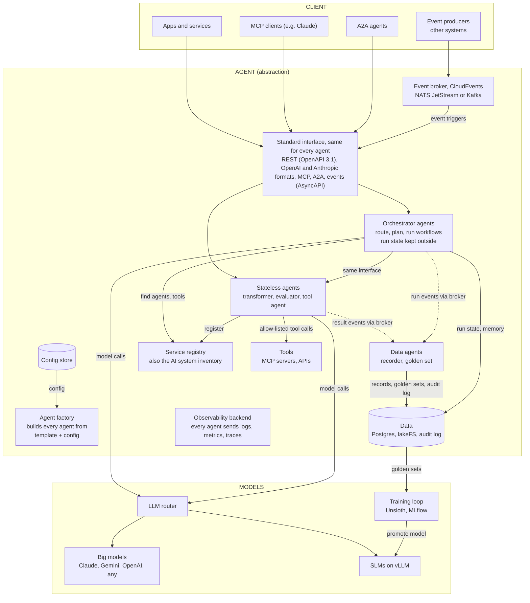
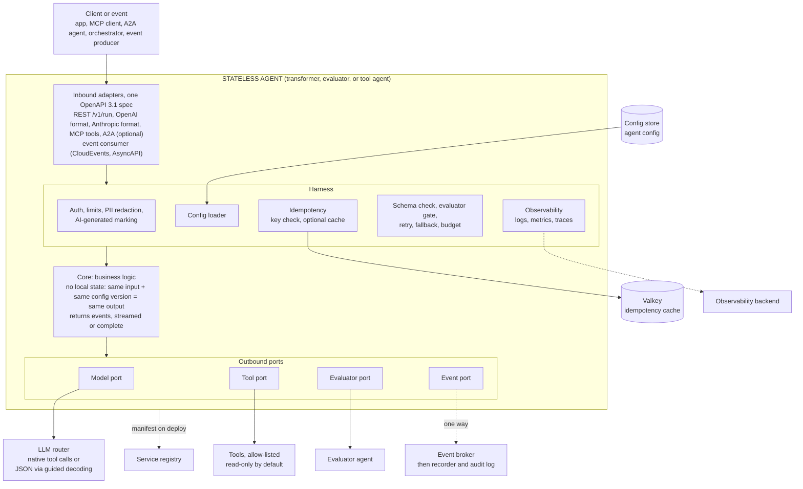
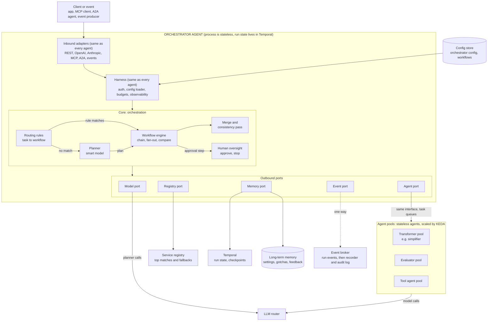

# Epic: SLM agent platform

Epic to train small language models (SLMs), wrap them in agents with a shared harness, and connect them through a registry, an orchestrator, and a platform MCP server.
For: Oleksandr (epic owner) and the delivery team

## How to read this epic

The main body holds the goal, the design at a glance, and the stories. Details live in the appendices.
Stories cite their context like a journal paper: \[B.3\] points to Appendix B, section 3; \[Fig. 2\] to Figure 2; \[R5\] to reference 5 in [K](#app-k). Every citation is a link.

| Appendix | Content |
| -------- | ------- |
| [A](#app-a) | Figure images (PNG) |
| [B](#app-b) | Agent model |
| [C](#app-c) | Configuration |
| [D](#app-d) | Event-driven architecture |
| [E](#app-e) | Compliance (ISO/IEC 42001, EU AI Act) |
| [F](#app-f) | Component design |
| [G](#app-g) | Platform standard |
| [H](#app-h) | Tech stack |
| [I](#app-i) | Model catalog |
| [J](#app-j) | Cost rules |
| [K](#app-k) | References |

## Epic goal

Cut token use and cost by moving narrow text-in, text-out tasks to small, owned models, run by agents that are consistent, easy to test, easy to find, and easy to scale.

## Value

- **Lower cost:** narrow tasks run on small owned models, and chat history holds short versions of long answers.
- **Faster answers:** small models respond in milliseconds to a few hundred milliseconds.
- **Data control:** models and data run on your own infrastructure, locally or in your cloud.
- **No lock-in:** any model, any provider, any cloud, behind the same adapters.
- **Reuse:** every new agent gets APIs, security, observability, registry, and MCP access from the harness.
- **Gets better over time:** every run feeds the golden set, which trains better models and evaluators.
- **Fits a bigger system:** event-driven by design, so agents plug into existing event streams.
- **Audit-ready:** built-in evidence for ISO/IEC 42001 and the EU AI Act.

## Design at a glance

<a id="fig1"></a>

### Figure 1: grand design



*Figure 1. Grand design: client, agent, and models.*

The system has three parts:

- **Client:** anything that calls an agent: apps, MCP clients, A2A agents.
- **Agent:** an abstraction. The agent factory builds each agent from one template plus its config. There are three agent classes: stateless agents, orchestrator agents, and data agents (see [B.1](#b1)). Every agent has the same interface, so any client or orchestrator calls any agent the same way.
- **Records:** stateless agents never store anything. They send a one-way result event through the event broker, and the recorder (a data agent) stores it. This keeps agents stateless and idempotent.
- **Events:** agents are part of a bigger event-driven system. Other systems start agents with CloudEvents through the broker, and agents publish their results as events \[[D.1](#d1)\].
- **Compliance:** every agent declares its purpose and risk class, the registry doubles as the AI system inventory, and an append-only audit log records every call \[[E.1](#e1), [E.5](#e5)\].
- **Models:** agents call models only through the LLM router. Big models and SLMs sit behind it. The training loop turns golden sets into new SLMs.

<a id="fig2"></a>

### Figure 2: stateless agent (no routing)



*Figure 2. Stateless agent (transformer, evaluator, or tool agent).*

A stateless agent does one task and keeps nothing between calls:

1. A request comes in through any inbound adapter, including an event from the broker.
1. The harness checks auth and limits, loads config, checks the idempotency key, and wraps the call with schema check, evaluator gate, retry, fallback, and budget.
1. The core runs the business logic and returns events, streamed or complete. Same input and same config version give the same output.
1. Outbound ports call the LLM router, allow-listed tools, and an evaluator agent.
1. A one-way result event goes to the event broker. The agent never reads it back.
1. On deploy, the agent registers its manifest in the service registry.

<a id="fig3"></a>

### Figure 3: orchestrator agent



*Figure 3. Orchestrator agent.*

An orchestrator agent has the same interface and harness. Only the core is different. Its process is also stateless: run state lives in Temporal, so any orchestrator pod can resume any run.

1. Routing rules from the config store pick a workflow for the task.
1. If no rule matches, the planner (a smart model) plans the run.
1. The workflow engine runs the steps as chain, fan-out, or compare, with Temporal keeping run state.
1. It finds agents in the registry and calls agent pools through the same interface, over task queues.
1. Steps that need a person go through human oversight: approve or stop.
1. Results are merged, checked for consistency, and returned. Each step emits an event for the recorder and the audit log.

PNG versions of the figures, for slides, are in [A](#app-a).

## Success metrics

| Metric                         | How it is measured                                  | Target (to confirm in Phase 1) |
| ------------------------------ | --------------------------------------------------- | ------------------------------ |
| Token spend on the big model   | Router token counts vs the Phase 1 baseline         | −30%                           |
| Cost per 1,000 requests        | Router cost plus GPU hosting cost                   | Below the baseline             |
| Simplifier quality             | `facts_kept` on the golden test set                 | ≥ 0.95                         |
| Fallback rate                  | Share of requests sent to the big model             | < 10%                          |
| Registry search accuracy       | Correct main tool in top 3 on the query test set    | ≥ 90%                          |
| Run recovery                   | Failed runs resumed from checkpoint without restart | 100%                           |

## Epic acceptance criteria

- The whole platform runs locally with `docker compose up`.
- The same platform deploys to the cloud on Kubernetes, with infrastructure in Terraform, on AWS or GCP.
- Every agent uses the shared harness and follows the platform standard.
- All agent classes (stateless, orchestrator, data) share one interface and one config schema, with config loaded from object storage.
- Every API has an OpenAPI 3.1 spec, and MCP tools are generated from it.
- Any model, big or small, is swapped by changing LLM router config only.
- Stateless agents keep no state; a repeated call with the same idempotency key returns the same result with no repeated side effects.
- Only data agents write records.
- Orchestration (routing rules, workflows, limits, approvals) is config in the config store, versioned and pinned per run.
- Every agent answers through native, OpenAI-compatible, and Anthropic-compatible APIs, with streaming and complete responses.
- New agents and tools register automatically on deploy, and can also be added by hand with approval.
- The orchestrator resumes a failed multi-step run from the last checkpoint.
- The platform MCP server lets any MCP client search the registry, run agents, manage runs, and manage golden sets.
- The success metrics are measured on a live dashboard.
- Every agent can be started by an API call or a CloudEvents event, and publishes its results as events, with an AsyncAPI spec.
- No agent goes live without a governance block (purpose, risk class, owner, oversight), and an audit export and documentation pack exist for every agent version.

## Non-goals

- Training general-purpose models. Every SLM is trained for one narrow task.
- Replacing the big model for open-ended work.
- A public marketplace for third-party agents in this epic.
- Multi-tenant billing.
- Legal classification of use cases. The platform records the decision; legal makes it.
- ISO/IEC 42001 certification itself. The platform supplies evidence to the organization's AI management system.

## Principles

- **Model-agnostic.** Every model is text in, text out, behind the LLM router. Claude, Gemini, OpenAI, and open models are interchangeable by config.
- **Agent as an abstraction.** The agent factory builds every agent from one template plus config. All agent classes share the same endpoints, envelope, config schema, and harness, and only get the modules they need.
- **Standards first.** OpenAPI 3.1 for every API, MCP tools generated from it, JSON Schema for config.
- **Cheap to run.** Scale to zero, CPU where possible, object storage for config and data.
- **Open-weight teacher by default.** Training data is generated with open models the team runs itself, so no provider terms restrict the data. A hosted teacher is allowed only after its terms are checked \[[R1](#r1)\].
- **Stateless agents.** No agent process keeps state. Run state lives in Temporal, records are written only by data agents, and every call is idempotent.
- **Same stack everywhere.** Local Docker, AWS, and GCP run the same containers and the same database setup.
- **Nothing ships without an eval.** Every model and prompt change passes the golden set before release.
- **Event-driven.** Every agent can be triggered by events and publishes events, so it fits into a bigger system.
- **Compliance by design.** Purpose, risk class, oversight, and logging are part of every agent's config, not added later.

## Phases

| Phase | Name                                        | Weeks |
| ----- | ------------------------------------------- | ----- |
| 0     | Agent harness                               | 3     |
| 1     | Baseline and LLM router                     | 2     |
| 2     | Simplifier SLM and model lifecycle          | 4     |
| 3     | Simplifier agent                            | 2     |
| 4     | Golden set agent and evaluator SLM          | 4     |
| 5     | Service registry                            | 5     |
| 6     | Platform MCP server                         | 2     |
| 7     | Orchestrator                                | 6     |
| 8     | Production readiness                        | 3     |
| 9     | Governance and compliance                   | 3     |
| 10    | Shared memory at scale                      | Later |
| 11    | System prompt improver and router SLM       | Later |

Total: about 29–33 weeks for one engineer, with overlap.
Phases 0 and 1 run in parallel.
Phase 2 data work starts during Phase 0.

Design details for each phase are in [F](#app-f).

## Phase 0: agent harness

Estimate: 3 weeks.

The harness is a shared library and template. Agents differ only in business logic. Architecture: [F.1](#f1).

### Harness: stories

1. **H-1** Harness library with ports, event model, and envelope. \[[F.1](#f1), [F.2](#f2), [G.1](#g1)\]
1. **H-2** Inbound adapters: native, OpenAI-compatible, Anthropic-compatible, with streaming. \[[F.2](#f2), [G.1](#g1), [R2](#r2)\]
1. **H-3** Outbound model port that calls the LLM router, plus direct adapters (vLLM, llama.cpp) for local tests without the router. \[[F.1](#f1), [I](#app-i), [R3](#r3)\]
1. **H-4** Harness features: schema check, evaluator gate, retry, fallback, timeout, budget, idempotency. \[[B.2](#b2), [G.1](#g1)\]
1. **H-5** A2A adapter: JSON-RPC endpoint, task states, signed agent card. \[[G.1](#g1)\]
1. **H-6** Security middleware: auth, scopes, rate limits, PII redaction. \[[G.3](#g3)\]
1. **H-7** Observability: logs, traces, metrics, Langfuse. \[[G.2](#g2)\]
1. **H-8** Testing kit: fake adapters, contract tests per API, record and replay. \[[F.1](#f1)\]
1. **H-9** Local debug profile: Docker Compose, hot reload, debugger port. \[[G.4](#g4)\]
1. **H-10** Template repo: Dockerfile, Helm chart, CI (tests, image signing, deploy, registry registration). \[[G.4](#g4), [H](#app-h)\]
1. **H-11** Adapter package published separately for reuse in other projects. \[[F.1](#f1)\]
1. **H-12** Config loader: reads the agent config from object storage, checks it against the JSON Schema, reloads on change. \[[C.1](#c1)\]
1. **H-13** OpenAPI 3.1 spec per agent, with MCP tools generated from it. \[[G.1](#g1)\]
1. **H-14** One agent interface for all classes: stateless, orchestrator, and data agents use the same template. \[[B.1](#b1), [B.5](#b5), [Fig. 1](#fig1)\]
1. **H-15** Agent factory: CLI that scaffolds a new agent by class and kind, with modules switched on by config. \[[B.5](#b5)\]
1. **H-16** Tool port: native tool calls when the model route supports them, JSON with guided decoding otherwise; read and write tool modes. \[[B.3](#b3), [R2](#r2)\]
1. **H-17** Event port: one-way result events to the event broker, in CloudEvents format. \[[B.4](#b4), [D.1](#d1), [R13](#r13)\]
1. **H-18** Idempotency: key check on every call, optional result cache in Valkey, key passed to write tools. \[[B.2](#b2), [D.1](#d1)\]
1. **H-19** Stateless check in CI: the build fails if an agent writes to local disk or keeps data between calls. \[[B.2](#b2)\]
1. **H-20** Event consumer adapter: agents can be started by CloudEvents events, with the same core as REST. \[[D.1](#d1), [Fig. 2](#fig2), [R13](#r13)\]
1. **H-21** AsyncAPI 3.0 spec per agent, generated next to the OpenAPI spec. \[[D.1](#d1), [R14](#r14)\]
1. **H-22** Event reliability: idempotent consumers, retries with backoff, dead-letter topic per agent. \[[D.1](#d1)\]
1. **H-23** Broker adapters behind the event port: NATS JetStream, Kafka, AWS, GCP. \[[D.1](#d1), [H](#app-h)\]

**Done when** a dummy echo agent runs locally and in Kubernetes, answers through all APIs and through events, with streaming and complete responses, appears in traces, and passes contract tests.

## Phase 1: baseline and LLM router

Estimate: 2 weeks. Runs in parallel with Phase 0.

This is where token savings become real and measurable.

### LLM router: stories

1. **G-1** LiteLLM router in front of all model calls, big models and SLMs. \[[Fig. 1](#fig1), [H](#app-h), [R3](#r3)\]
1. **G-1b** Named model routes (for example `simplifier-slm`, `big-default`), so models are swapped in router config only. \[[C.1](#c1), [I](#app-i)\]
1. **G-2** Token and cost counting per request, per user, and per agent. \[[J](#app-j)\]
1. **G-3** Baseline report: current token spend and cost over at least two weeks. \[[J](#app-j)\]
1. **G-4** History swap in the harness: before a model call, long past answers are replaced by their simplified versions (enabled in Phase 3). \[[F.1](#f1), [J](#app-j)\]
1. **G-5** Cost model: GPU hosting cost vs API savings, with the break-even point. \[[J](#app-j)\]
1. **G-6** Savings dashboard. \[[G.2](#g2)\]

**Done when** the baseline is measured, the break-even point is known, and the dashboard shows live token spend.

## Phase 2: simplifier SLM and model lifecycle

Estimate: 4 weeks.

### Simplifier SLM: stories

1. **S-1** Rewrite rules and banned-word list. \[[C.1](#c1)\]
1. **S-2** Data generation: 2,000–5,000 pairs from real outputs, using an open-weight teacher. \[[I](#app-i), [R1](#r1)\]
1. **S-3** Metrics: tokens, readability, semantic similarity, `facts_kept`, banned words. \[[I](#app-i)\]
1. **S-4** Hand review of a sample and a held-out test set of at least 300 records. \[[E.5](#e5)\]
1. **S-5** Reproducible training pipeline (config, data version, seed) with Unsloth or TRL. \[[E.3](#e3), [H](#app-h)\]
1. **S-6** Train candidates on Qwen3, Gemma 3, and Llama 3.2 bases, and pick the best. \[[I](#app-i)\]
1. **S-7** Serve with vLLM, with guided decoding for JSON output. \[[I](#app-i), [R2](#r2)\]
1. **S-8** Optional: fine-tune an SLM on tool-call examples for tool agents, with its own eval. \[[B.3](#b3), [I](#app-i)\]

### Model lifecycle: stories

1. **M-1** MLflow: experiments, model registry, link from each model to its data version and scores. \[[E.5](#e5), [H](#app-h)\]
1. **M-2** Eval gate in CI: a new model ships only if it beats the current one on the golden set. \[[E.5](#e5)\]
1. **M-3** Shadow mode: the new model runs next to the current one without serving users. \[[G.4](#g4)\]
1. **M-4** Canary rollout and one-step rollback. \[[G.4](#g4)\]
1. **M-5** Quantized variants (4-bit) for CPU and edge use, each with its own eval. \[[I](#app-i)\]

**Done when** the SLM meets the targets on the held-out set and can be promoted and rolled back through CI.

## Phase 3: simplifier agent

Estimate: 2 weeks.

### Simplifier agent: stories

1. **A-1** Simplifier business logic in the core, using the harness. \[[Fig. 2](#fig2), [B.1](#b1)\]
1. **A-2** Evaluator gate on `facts_kept`, one retry, then fallback to a big model. \[[B.2](#b2)\]
1. **A-3** Every result sent as a one-way result event with `source` (which model produced the original). The recorder stores it. \[[B.4](#b4), [D.3](#d3)\]
1. **A-4** History swap switched on (G-4). \[[J](#app-j)\]
1. **A-5** Agent dashboard: pass rate, fallback rate, tokens saved, latency. \[[G.2](#g2)\]

**Done when** other services call it through any API, the agent keeps no state, repeated calls with the same key return the same result, every call is traced and recorded by the recorder, fallback works, and the savings show on the router dashboard.

## Phase 4: golden set agent and evaluator SLM

Estimate: 4 weeks.

### Golden set: stories

1. **D-0** Recorder agent (data agent): reads result events from the broker, removes PII, drops duplicates by `idempotency_key`, writes records to Postgres. \[[B.4](#b4), [D.1](#d1), [D.3](#d3)\]
1. **D-1** Golden set agent: reads records, scores them with a judge, sends uncertain ones to review. \[[B.1](#b1)\]
1. **D-2** Review UI: approve, reject, edit, with access control and an audit log. \[[E.5](#e5)\]
1. **D-3** Import from file upload, API call, or bucket watch. \[[H](#app-h)\]
1. **D-4** Export in JSONL, CSV, Parquet, and Hugging Face datasets format. \[[H](#app-h)\]
1. **D-5** Schema check and deduplication on import. \[[H](#app-h)\]
1. **D-6** Tags and splits (train, test, holdout) per record. \[[H](#app-h)\]
1. **D-7** Versioned datasets with lakeFS. Each export is an immutable version with an ID. \[[H](#app-h), [R7](#r7), [R8](#r8)\]
1. **D-8** Data rules: PII removal before storage, retention period, deletion on request. \[[E.5](#e5)\]

### Evaluator SLM: stories

1. **E-1** First evaluator SLM (ModernBERT or DeBERTa) trained on approved records. \[[I](#app-i)\]
1. **E-2** Agreement test against human labels. \[[E.5](#e5)\]
1. **E-3** Evaluator replaces the big-model judge in the harness once it passes E-2. \[[F.1](#f1)\]

**Done when** golden sets import and export in one step in every listed format, versions are immutable, PII rules apply, and the evaluator SLM matches human review on the test set.

## Phase 5: service registry

Estimate: 5 weeks.

Designed for thousands of agents, tools, APIs, and MCP servers. It is also the AI system inventory. Data model: [F.3](#f3).

### Registry: stories

1. **R-1** Data model and API. \[[F.3](#f3)\]
1. **R-2** Kubernetes controller (kopf): watches labeled deployments and reads `/manifest`. \[[F.3](#f3), [G.4](#g4)\]
1. **R-3** Docker watcher for local runs. \[[G.4](#g4)\]
1. **R-4** MCP import: calls `tools/list` and registers each tool. \[[F.3](#f3), [R5](#r5)\]
1. **R-5** OpenAPI import: registers each operation of a REST API. \[[F.3](#f3)\]
1. **R-6** Manual registration: API, UI, and YAML import. \[[F.3](#f3)\]
1. **R-7** Trust levels: internal signed entries go live automatically; external and manual entries need approval. \[[F.3](#f3), [E.5](#e5), [R5](#r5)\]
1. **R-8** Description scanning for hidden instructions on registration. \[[G.3](#g3), [R5](#r5)\]
1. **R-9** Description hash pinning: a changed description goes back to review. \[[R5](#r5)\]
1. **R-10** Health checks: dead entries marked inactive, never deleted. \[[F.3](#f3)\]
1. **R-11** Hybrid search: SQL filters, keyword search, vector search, reciprocal rank fusion, reranker. \[[H](#app-h), [I](#app-i), [R6](#r6), [R9](#r9)\]
1. **R-12** Search results return the main pick plus ranked fallbacks with difference metadata. \[[F.3](#f3)\]
1. **R-13** Search test set of at least 200 queries with expected results. \[[I](#app-i)\]
1. **R-14** Registry exposed as an MCP server (feeds Phase 6). \[[F.4](#f4)\]
1. **R-15** Event schemas (AsyncAPI) registered next to OpenAPI specs. \[[D.1](#d1), [R14](#r14)\]
1. **R-16** Registry entries carry the governance block and serve as the AI system inventory. \[[E.4](#e4), [E.5](#e5)\]

**Done when** new agents register automatically on deploy (local and Kubernetes), manual and external entries go through approval, changed descriptions are caught, and search meets the accuracy target.

## Phase 6: platform MCP server

Estimate: 2 weeks for the base, then new tools as each phase lands.

One MCP server that lets Claude, or any MCP client, work with the whole system.
Built with the harness and registered like any other agent. Tool list: [F.4](#f4).

### MCP server: stories

1. **P-1** Server built from the harness, with registry and agent tools. \[[F.4](#f4)\]
1. **P-2** Run, golden set, memory, and metrics tools as their phases land. \[[F.4](#f4)\]
1. **P-3** Resources and prompts. \[[F.5](#f5)\]
1. **P-4** Separate read and write scopes, confirmation on destructive tools, audit log on every call. \[[G.3](#g3)\]

**Done when** an MCP client can search the registry, run an agent, and export a golden set version end to end.

## Phase 7: orchestrator

Estimate: 6 weeks. Design: [F.6](#f6)–[F.9](#f9).

### Orchestrator: stories

1. **O-1** Orchestrator agent built from the harness, using registry search. \[[Fig. 3](#fig3), [F.6](#f6)\]
1. **O-2** Temporal workflows with a checkpoint per step. \[[F.8](#f8)\]
1. **O-3** Agent pools on task queues with KEDA autoscaling. \[[F.6](#f6), [J](#app-j)\]
1. **O-4** Fan-out and fan-in with overlap and a consistency pass. \[[F.7](#f7), [C.2](#c2)\]
1. **O-5** Compare runs with an evaluator and a tie rule. \[[F.7](#f7)\]
1. **O-6** Budgets per run: max tokens, cost, steps, and time. \[[C.2](#c2)\]
1. **O-7** Idempotent steps, so a resume never repeats a side effect. \[[B.2](#b2), [D.1](#d1)\]
1. **O-8** Cancel and human approval steps. \[[C.2](#c2), [E.5](#e5)\]
1. **O-9** Short-term memory (execution state) and long-term memory (settings, preferences, gotchas, feedback). \[[F.8](#f8), [F.9](#f9)\]
1. **O-10** Orchestrator config and workflow schemas (JSON Schema) in the config store. \[[C.2](#c2)\]
1. **O-11** Workflow engine that runs `chain`, `fan_out`, and `compare` patterns from workflow files. \[[C.2](#c2), [F.7](#f7)\]
1. **O-12** Routing rules and planner modes (`fixed`, `planned`, `hybrid`). \[[C.2](#c2)\]
1. **O-13** Version pinning per run, so config changes never affect running or resumed runs. \[[C.2](#c2)\]
1. **O-14** Workflow validation and dry run before activation, and rollback to a previous version. \[[C.2](#c2)\]
1. **O-15** Save a reviewed planned run as a new workflow file. \[[C.2](#c2)\]
1. **O-16** Event triggers: workflows started by events, with run and step events published at each stage. \[[D.1](#d1), [D.3](#d3)\]

**Done when** the orchestrator runs a fan-out simplification from a workflow file in the config store, switches workflows by config only, runs a compare job, resumes a run after a killed step without repeating side effects, stops a run that exceeds its budget, and loads settings from long-term memory.

## Phase 8: production readiness

Estimate: 3 weeks. Parts of it run alongside earlier phases.

### Production: stories

1. **X-1** Terraform modules for AWS and GCP with the same inputs and outputs. \[[G.4](#g4), [H](#app-h)\]
1. **X-2** GPU setup on Kubernetes (NVIDIA GPU Operator) and model weight storage with fast cold start. \[[G.4](#g4)\]
1. **X-3** SLOs and alerts for every agent. \[[G.2](#g2)\]
1. **X-4** Backups and a tested restore for Postgres, object storage, and golden sets. \[[E.6](#e6)\]
1. **X-5** Load tests for pools and the registry. \[[G.4](#g4)\]
1. **X-6** Runbooks for common failures. \[[E.5](#e5)\]
1. **X-7** Cost dashboard per agent and per pool. \[[J](#app-j)\]
1. **X-8** Event broker on Kubernetes and in Docker Compose, with retention and consumer-lag alerts. \[[D.1](#d1), [H](#app-h)\]

**Done when** the platform deploys to both clouds from Terraform, a restore test passes, and alerts fire on SLO breaches.

## Phase 9: governance and compliance

Estimate: 3 weeks. Parts of it run alongside earlier phases.

### Governance: stories

1. **C-1** `governance` block in the agent config schema, enforced by the registry on activation. \[[E.4](#e4)\]
1. **C-2** Prohibited-practice checklist at registration. \[[E.4](#e4), [R10](#r10)\]
1. **C-3** Audit log data agent: append-only, object lock, retention per risk class, export API. \[[E.6](#e6)\]
1. **C-4** Documentation pack generator: technical documentation, instructions for use, and model card per agent version, built from config, OpenAPI, AsyncAPI, and MLflow. \[[E.5](#e5), [R12](#r12)\]
1. **C-5** AI-generated marking on outputs for `limited` risk and above, and a disclosure flag for client apps. \[[E.2](#e2), [E.5](#e5), [R10](#r10)\]
1. **C-6** Human oversight controls: review queue, approval steps, stop control, all recorded in the audit log. \[[E.5](#e5), [Fig. 3](#fig3)\]
1. **C-7** Incident flow: incident events, alert routing, runbook for serious incidents. \[[D.3](#d3), [E.5](#e5)\]
1. **C-8** Training compute logged per fine-tune run, with a check against the GPAI modification threshold. \[[E.3](#e3), [R11](#r11)\]
1. **C-9** Control mapping report: ISO 42001 Annex A and AI Act articles to platform evidence, ready for a Statement of Applicability. \[[E.5](#e5), [R12](#r12)\]

**Done when** no agent can go live without a governance block, a high-risk agent is blocked without an impact assessment and oversight, and an audit export and documentation pack can be produced for any agent version.

## Phase 10: shared memory at scale

Plan now, build when scaling.

| Layer            | What it holds                            | Store                  |
| ---------------- | ---------------------------------------- | ---------------------- |
| Execution state  | The current run                          | Temporal               |
| Session context  | Recent turns, in simplified form         | Redis or Valkey        |
| Long-term memory | Settings, preferences, gotchas, feedback | Postgres with pgvector |
| Golden sets      | Versioned datasets                       | Object storage         |

- Agents stay stateless.
- Agents receive a `context_ref`, fetch only what they need, and return results.
- The orchestrator owns writes to memory.

## Phase 11: later ideas

- **System prompt improver:** an SLM tags problems in stored records, a big model suggests prompt changes, and the golden set decides whether to keep them.
- **Router SLM:** a classifier trained on logged runs replaces part of the orchestrator's routing, with a confidence threshold and fallback.

## Risks

| Risk                                          | Mitigation                                           |
| --------------------------------------------- | ---------------------------------------------------- |
| GPU costs more than the tokens saved          | Break-even check in Phase 1 before scaling           |
| Simplifier drops facts                        | `facts_kept` gate, fallback, human review            |
| Poisoned tool descriptions                    | Trust levels, scanning, hash pinning, allow-lists    |
| Provider terms restrict training data         | Open-weight teacher, `source` field on every record  |
| A use case is later classed as high-risk      | Governance block, audit log, and oversight exist from day one |
| Event duplicates or out-of-order delivery     | Idempotent consumers, partition by `run_id`, dead-letter topics |
| Large scope for one engineer                  | Each phase ships on its own; later phases can move   |

## Dependencies

- GPU access for training and serving (local, rented, or cloud).
- A cloud account on AWS or GCP for staging and prod.
- Real outputs to build the first training data.
- A reviewer for the golden set.
- Legal and compliance owner to classify each use case.

## Open decisions

- Banned-word list and final targets for the success metrics.
- First cloud: AWS or GCP.
- Whether A2A ships in version 1.
- Event broker: NATS JetStream (recommended) or the company's existing Kafka.

<a id="app-a"></a>

## Appendix A: figure images

The figures in the main body are Mermaid diagrams, so they render as text-based diagrams and can be edited in place. PNG versions for slides and documents are in the `diagrams/` folder:

<a id="a1"></a>

### A.1 Figure 1 image

`diagrams/diagram-1-grand-design.png`

<a id="a2"></a>

### A.2 Figure 2 image

`diagrams/diagram-2-stateless-agent.png`

<a id="a3"></a>

### A.3 Figure 3 image

`diagrams/diagram-3-orchestrator-agent.png`

<a id="app-b"></a>

## Appendix B: agent model
<a id="b1"></a>

### B.1 Agent classes

| Class        | Kind         | What it does                                     | State                          | Tools                 | Model                              | Examples                           |
| ------------ | ------------ | ------------------------------------------------ | ------------------------------ | --------------------- | ---------------------------------- | ---------------------------------- |
| Stateless    | Transformer  | Text in, text out                                | None                           | No                    | SLM or big model                   | Simplifier, summarizer, formatter  |
| Stateless    | Evaluator    | Scores or labels an input                        | None                           | No                    | Encoder SLM on CPU                 | `facts_kept` judge, classifier     |
| Stateless    | Tool agent   | Answers by calling tools                         | None                           | Yes, allow-listed     | SLM or big model with tool calling | Lookup, retrieval, registry search |
| Orchestrator | Orchestrator | Routes, plans, runs workflows                    | Outside the process (Temporal) | Yes, through registry | Smart model for planning           | Orchestrator                       |
| Data         | Data agent   | Owns a store; the only class that writes records | In its own store               | No                    | Optional (judge)                   | Recorder, golden set agent         |

<a id="b2"></a>

### B.2 Properties every agent must have

- **Same interface:** the same endpoints, envelope, and OpenAPI 3.1 spec, with MCP tools generated from it.
- **Stateless process:** nothing is kept in memory or on disk between calls. Any pod can serve any request, so agents scale by adding pods.
- **Idempotent:** a repeated call with the same `idempotency_key` returns the same result and never repeats a side effect.
- **Pinned versions:** each response reports the config, prompt, and model route versions used.
- **Deterministic by default:** temperature 0 and fixed routes, unless the config says otherwise.
- **Config from the config store:** checked against the schema, reloaded without a restart.
- **Budgets and timeouts** on every call.
- **Telemetry:** logs, metrics, and traces for every call.
- **Self-registration:** the manifest goes to the registry on deploy.
- **Health, ready, and graceful shutdown**, so pools can scale up and down safely.
- **Least privilege:** only the scopes, agents, and tools listed in its config.
- **Event-ready:** can be started by events and publishes result events \[[D.1](#d1)\].
- **Governed:** has a governance block with purpose, risk class, owner, and oversight \[[E.4](#e4)\].

<a id="b3"></a>

### B.3 Tool use

- Stateless agents may use tools. Tools are allow-listed in the agent config and found through the registry.
- Tools are **read-only by default**. A tool with side effects (write, send, delete) is allowed only if the config marks it as a write tool, and the agent passes its `idempotency_key` to it, so a retry never repeats the action.
- **Model support:** vLLM supports native tool calling for many open models through tool parsers \[[R2](#r2)\]. If a model does not support tool calls, the harness asks for the call as JSON and uses guided decoding to force the tool's schema. This works with any model, including SLMs.
- **SLMs and tools:** small models can call tools, but less reliably than big models. For tool agents, fine-tune the SLM on tool-call examples (story S-8) and keep a fallback route to a big model.
- Each model route in the LLM router declares whether it supports native tool calls, so the harness picks the right mode.

<a id="b4"></a>

### B.4 How records are stored without breaking statelessness

1. A stateless agent returns its output and metrics in the response envelope.
1. The harness also sends a one-way result event (input, output, metrics, versions, `idempotency_key`) to the event broker.
1. The recorder agent (a data agent) reads the stream, removes PII, drops duplicates by `idempotency_key`, and writes the record to Postgres.
1. The golden set agent builds datasets from those records.

The agent never reads records back, so its output never depends on stored state.

<a id="b5"></a>

### B.5 Agent factory

- One template: harness, inbound adapters, outbound ports, Dockerfile, Helm chart, CI.
- The class, kind, and modules come from config. An agent only gets the parts it needs.
- A CLI scaffolds a new agent: `agentctl new <name> --kind transformer|evaluator|tool|orchestrator|data`.

| Module                                                  | Stateless agents | Orchestrator          | Data agents |
| ------------------------------------------------------- | ---------------- | --------------------- | ----------- |
| Standard interface                                      | Always           | Always                | Always      |
| Harness (auth, config, idempotency, budgets, telemetry) | Always           | Always                | Always      |
| Model port (LLM router)                                 | Always           | Always                | Optional    |
| Evaluator gate                                          | Optional         | Optional              | No          |
| Tool port                                               | Tool agents only | Optional              | No          |
| Result event port                                       | Optional         | Optional              | No          |
| Own store                                               | Never            | Never (uses Temporal) | Always      |
| Routing rules and planner                               | No               | Always                | No          |
| Workflow engine (Temporal)                              | No               | Always                | No          |
| Registry search                                         | No               | Always                | No          |
| Long-term memory                                        | No               | Optional              | No          |
| A2A                                                     | Optional         | Optional              | Optional    |

<a id="app-c"></a>

## Appendix C: configuration
<a id="c1"></a>

### C.1 Agent configuration

All configs live in one **config store**: a versioned object storage bucket (MinIO locally, S3 on AWS, GCS on GCP).
Each agent reads one config file from it.
Every file is versioned, checked against a JSON Schema on load, and reloaded without a restart.
Secrets are referenced, never stored in the file.

```yaml
apiVersion: agents/v1
kind: AgentConfig
metadata:
  name: simplifier
  version: 1.2.0
  owner: platform-team
spec:
  class: stateless                # stateless | orchestrator | data
  kind: transformer               # transformer | evaluator | tool | orchestrator | data
  modules: [evaluator_gate, result_events]  # optional modules to switch on
  interface:
    rest: true
    openai: true
    anthropic: true
    mcp: true
    a2a: false
  model:
    route: simplifier-slm         # name of a route in the LLM router
    fallback_route: big-default
    temperature: 0
    max_tokens: 800
  prompts:
    system_ref: s3://agent-config/prompts/simplifier/v3.md
  harness:
    evaluator: facts_kept
    threshold: 0.95
    retries: 1
    timeout_ms: 30000
    budget:
      max_tokens: 2000
  scaling:
    min_replicas: 0               # scale to zero when idle
    max_replicas: 20
    queue: simplify
  observability:
    log_level: info
    trace_sample_rate: 0.1
  tools:
    - name: glossary_lookup
      mode: read                  # read | write (write needs idempotency_key)
  security:
    scopes: [simplify:run]
    allowed_agents: [evaluator-facts]
  events:
    consumes: [agents.task.requested.v1]
    produces: [agents.task.completed.v1, agents.task.failed.v1]
  governance:
    intended_purpose: "Rewrite internal text in plain language, keeping all facts."
    risk_class: minimal
    owner: platform-team
    human_oversight: review_on_low_score
  secrets:
    api_key_ref: vault://agents/simplifier/api-key
```

The full `governance` block is described in [E.4](#e4).

The registry manifest is built from this config plus the agent's OpenAPI spec, so there is one source of truth.

<a id="c2"></a>

### C.2 Orchestration configuration

The orchestrator is configured the same way as any agent, and its workflows are config too.
Nothing about how work is split, routed, retried, or merged is hard-coded.

Config store layout:

```text
config-store/
  agents/
    simplifier.yaml
    evaluator-facts.yaml
    orchestrator.yaml
  workflows/
    simplify-long-doc.yaml
    compare-simplifiers.yaml
  schemas/
    agent-config.schema.json
    orchestrator-config.schema.json
    workflow.schema.json
```

Orchestrator config (routing, planning, limits):

```yaml
apiVersion: agents/v1
kind: OrchestratorConfig
metadata:
  name: orchestrator
  version: 1.0.0
spec:
  planner:
    mode: hybrid                  # fixed | planned | hybrid
    model_route: big-planner      # route in the LLM router
  routing:
    - match: { task: simplify_text }
      workflow: simplify-long-doc
    - match: { task: compare_outputs }
      workflow: compare-simplifiers
    - default: planned            # no rule matched: the smart model plans the run
  registry:
    top_k: 5
    min_trust: internal-signed
  limits:
    max_steps: 50
    max_tokens: 200000
    max_cost_usd: 5
    timeout_s: 900
  memory:
    short_term: temporal
    long_term: postgres
    load: [settings, preferences, gotchas]
  approvals:
    require_for: [external_tool, cost_above_usd_2]
```

Workflow config (one file per workflow):

```yaml
apiVersion: agents/v1
kind: Workflow
metadata:
  name: simplify-long-doc
  version: 2.1.0
spec:
  pattern: fan_out                # chain | fan_out | compare
  split:
    by: section
    max_tokens: 1500
    overlap_tokens: 100
  steps:
    - id: simplify
      agent: { task: simplify_text }   # found in the registry
      parallel: true
      pool: simplify
    - id: merge
      agent: { name: merger }
    - id: consistency
      agent: { name: simplifier }
      input: merged
  evaluate:
    agent: evaluator-facts
    threshold: 0.95
  on_failure:
    retries: 1
    then: fallback_route          # fallback_route | skip | stop
  budget:
    max_tokens: 20000
```

Rules:

- **Modes:** `fixed` runs only configured workflows, `planned` lets the smart model plan every run, `hybrid` uses a workflow when a routing rule matches and plans otherwise.
- **Version pinning:** each run records the workflow and config versions it started with, so a config change never breaks a run in progress or a resume.
- **Validation:** a new workflow is checked against the schema and dry-run before it becomes active.
- **Rollback:** switching back means pointing to the previous version in the config store.
- **Planned runs can be saved:** a good plan from the smart model can be saved as a new workflow file, after review.

<a id="app-d"></a>

## Appendix D: event-driven architecture

Agents are built to run inside a bigger event-driven system. Every agent can be started by an API call or by an event, and runs the same core either way.

<a id="d1"></a>

### D.1 EDA: rules

- **Two ways in, one core:** the event consumer is just another inbound adapter. The business logic does not know whether a request came from REST or from an event.
- **Event format:** CloudEvents 1.0 \[[R13](#r13)\] for every event, with extensions for `traceparent`, `idempotencykey`, `configversion`, and `modelroute`.
- **Event contracts:** each agent publishes an AsyncAPI 3.0 \[[R14](#r14)\] spec next to its OpenAPI spec. Event schemas are JSON Schema files in the config store, registered in the service registry.
- **Delivery:** at-least-once. Every consumer is idempotent: it drops duplicates by event `id` and `idempotencykey`.
- **Failures:** retries with backoff, then a dead-letter topic per agent, with an alert.
- **Ordering:** events for one run share a partition key (`run_id`), so their order is kept.
- **Request and reply:** long tasks use `task.requested` and `task.completed` events with a correlation ID instead of a waiting HTTP call.
- **Data agents publish safely:** they use a transactional outbox, so a record and its event are written together.
- **Orchestration:** Temporal workflows can be started by events and emit events at each step.
- **Replay:** events are kept for a set retention period, so records can be rebuilt and incidents investigated.
- **Scaling:** KEDA scales agent pools on consumer lag.
- **Broker behind a port:** agents talk to an event port, not to a broker directly. Adapters for NATS JetStream, Kafka, AWS (SNS/SQS, EventBridge), and GCP Pub/Sub.

<a id="d2"></a>

### D.2 EDA: topic naming

`<domain>.<entity>.<event>.v<major>`, for example `agents.task.completed.v1`.

<a id="d3"></a>

### D.3 EDA: event catalog

| Event type                       | Producer                  | Main consumers                         |
| -------------------------------- | ------------------------- | -------------------------------------- |
| `agents.task.requested.v1`       | Any client or orchestrator | Stateless agents                      |
| `agents.task.completed.v1`       | Stateless agents          | Caller, recorder, audit log            |
| `agents.task.failed.v1`          | Stateless agents          | Caller, recorder, alerting             |
| `runs.run.started.v1`            | Orchestrator              | Recorder, audit log                    |
| `runs.step.completed.v1`         | Orchestrator              | Recorder, audit log                    |
| `runs.run.completed.v1`          | Orchestrator              | Caller, recorder, audit log            |
| `oversight.review.required.v1`   | Orchestrator, golden set agent | Review UI, human reviewers        |
| `oversight.review.decided.v1`    | Review UI                 | Orchestrator, golden set agent, audit log |
| `models.model.promoted.v1`       | MLflow pipeline           | LLM router, audit log                  |
| `config.config.changed.v1`       | Config store              | Agents (reload), audit log             |
| `registry.entry.changed.v1`      | Service registry          | Orchestrator, audit log                |
| `incidents.incident.detected.v1` | Any agent, monitoring     | On-call, compliance team, audit log    |

<a id="app-e"></a>

## Appendix E: compliance by design (ISO/IEC 42001 and EU AI Act)

<a id="e1"></a>

### E.1 Compliance: what the platform can and cannot do

- **ISO/IEC 42001** certifies an organization's AI management system, not a piece of software. The platform cannot be "certified" on its own \[[R12](#r12)\]. It is designed to provide the controls and the evidence an auditor asks for.
- **The EU AI Act** sets obligations by role (provider or deployer) and by the risk class of each use case, not by the platform. The same simplifier can be minimal risk in one product and part of a high-risk system in another.
- So the platform makes every agent **declare its purpose and risk class**, and switches on the matching controls automatically.
- Final classification of each use case is a legal decision. The platform records it; it does not make it.

<a id="e2"></a>

### E.2 Compliance: EU AI Act dates to plan for

| Date             | What applies                                                                   |
| ---------------- | ------------------------------------------------------------------------------ |
| 2 August 2026    | Article 50 transparency obligations (disclosing AI interaction and AI-generated content) |
| 2 December 2026  | Article 50(2) marking of AI-generated content for systems already on the market |
| 2 December 2027  | High-risk obligations for Annex III (stand-alone) systems                      |
| 2 August 2028    | High-risk obligations for Annex I (AI in regulated products)                   |

Dates as set by the Digital Omnibus on AI, Regulation (EU) 2026/1744 \[[R10](#r10)\]. Check for later changes.

<a id="e3"></a>

### E.3 Compliance: fine-tuned SLMs and GPAI rules

- Under the Commission's GPAI guidelines, a company that modifies a model becomes the provider of a new general-purpose model if the modification uses more than one third of the original model's training compute \[[R11](#r11)\].
- LoRA fine-tuning of small models uses a tiny fraction of that. The fine-tuned SLMs are expected to stay below the threshold, but this must be checked per model.
- The training pipeline logs training compute for every run in MLflow, as evidence.
- The company is still the **provider of the AI system** it builds with these models, so the system-level rules below apply.

<a id="e4"></a>

### E.4 Compliance: governance block in every agent config

```yaml
governance:
  intended_purpose: "Rewrite internal text in plain language, keeping all facts."
  risk_class: minimal              # minimal | limited | high | prohibited_check_failed
  eu_ai_act_role: provider         # provider | deployer
  impact_assessment_ref: s3://governance/impact/simplifier-v1.pdf
  owner: platform-team
  human_oversight: review_on_low_score   # none | review_on_low_score | approve_every_run
  ai_generated_marking: true
  data_sources: [internal_docs]
  log_retention_days: 365
```

Rules enforced by the platform:

- The registry does not activate an agent without a `governance` block.
- A `high` risk agent is not activated without an impact assessment reference, human oversight other than `none`, and log retention of at least six months (the minimum the AI Act sets for high-risk logs; confirm the period with legal).
- A prohibited-practice checklist is part of registration. A failed check blocks activation.
- `limited` risk and above get AI-generated marking on every output.

<a id="e5"></a>

### E.5 Compliance: control mapping

| Requirement                                   | Platform feature                                                   | Evidence produced                          |
| --------------------------------------------- | ------------------------------------------------------------------ | ------------------------------------------ |
| ISO 42001 A.3 roles and responsibilities      | `owner` in every config and registry entry                         | Registry export                            |
| ISO 42001 A.4 resources                       | Registry as AI system inventory: agents, models, data, compute     | Inventory report                           |
| ISO 42001 A.5 impact assessment               | Required `impact_assessment_ref` and `risk_class`                  | Impact assessment files, registry entries  |
| ISO 42001 A.6 life cycle                      | Eval gate, versioning, shadow and canary rollout, rollback         | MLflow runs, model cards, deploy records   |
| ISO 42001 A.7 data                            | lakeFS versions, `source` field, PII removal, dedup                | Dataset lineage, data quality reports      |
| ISO 42001 A.8 information for interested parties | Model cards, instructions for use from the manifest, AI marking | Generated documentation pack               |
| ISO 42001 A.9 use of AI systems               | `intended_purpose`, scopes, allow-lists, human oversight           | Config history, audit log                  |
| ISO 42001 A.10 third parties                  | Registry trust levels, approval for external tools and models      | Supplier and model assessments             |
| AI Act Art. 9 risk management                 | Risk register per agent, linked from config                        | Risk register                              |
| AI Act Art. 10 data governance                | Same as A.7                                                        | Dataset lineage                            |
| AI Act Art. 11 technical documentation        | Documentation pack built from config, OpenAPI, AsyncAPI, model card | Annex IV-style pack per agent version     |
| AI Act Art. 12 record-keeping                 | Automatic events for every call and run, append-only audit log     | Audit log with retention                   |
| AI Act Art. 13 transparency to deployers      | Instructions for use generated from the manifest                   | Documentation pack                         |
| AI Act Art. 14 human oversight                | Approval steps, review queue, `run_cancel` stop control            | Review decisions in the audit log          |
| AI Act Art. 15 accuracy, robustness, security | Eval gates, drift monitoring, security standard, signed images     | Eval reports, monitoring dashboards        |
| AI Act Art. 17 quality management             | Runs inside the ISO 42001 management system                        | AIMS records                               |
| AI Act Art. 50 transparency                   | `ai_generated` flag on outputs, disclosure flag for client apps    | Output metadata                            |
| AI Act Art. 72 post-market monitoring         | Dashboards, feedback, drift alerts                                 | Monitoring reports                         |
| AI Act Art. 73 serious incidents              | `incidents.incident.detected.v1` events, incident runbook          | Incident records                           |

<a id="e6"></a>

### E.6 Compliance: audit log

- Built by a data agent from the event broker: every call, run, config change, model promotion, review decision, and incident.
- Append-only, stored in object storage with object lock (write once, read many).
- Retention per risk class from the `governance` block.
- Exportable per agent, per version, and per time range for audits.

<a id="app-f"></a>

## Appendix F: component design

<a id="f1"></a>

### F.1 Harness: architecture

Hexagonal architecture (ports and adapters):

```text
       inbound adapters                                 outbound adapters
  REST /v1/run ──┐                                 ┌── Model: LLM router (all models behind it)
  OpenAI API ────┤                                 ├── Store: Postgres, object storage
  Anthropic API ─┼─> [ RunPort ] ─> CORE ─> [ ports ] ┼── Evaluator
  A2A, events ───┤                business            ├── Telemetry: OTel, Langfuse
  MCP ───────────┘                logic               └── Registry
```

- **Core:** pure business logic, no framework or network code.
- **Ports:** `ModelPort`, `StorePort`, `EvaluatorPort`, `TelemetryPort`, `RegistryPort`.
- **Adapters:** swappable implementations for inbound APIs and outbound services.

An agent implements one function:

```python
async def handle(input: TaskInput, ctx: Context) -> AsyncIterator[Event]:
    ...
```

<a id="f2"></a>

### F.2 Harness: streaming and complete responses

- One internal event model: `start`, `delta`, `tool_call`, `metrics`, `end`, `error`.
- Streaming: events mapped to server-sent events in native, OpenAI, or Anthropic format.
- Complete: the harness collects all events and returns one response.

<a id="f3"></a>

### F.3 Registry: data model

- Entry: name, type (agent, tool, API, MCP), task, description, input and output schema, endpoint, version, auth method, owner, tags, trust level, status.
- Live metrics per entry: latency, error rate, cost.
- Relationships: `fallback_of`, with metadata on the differences (cost, speed, quality, limits, notes).
- Description hash per entry, to catch changes.
- Embedding model name per vector.

Example entry:

```json
{
  "name": "simplifier",
  "type": "agent",
  "task": "simplify_text",
  "description": "Rewrites complex text in plain language, keeping all facts.",
  "endpoint": "https://agents.internal/simplifier/v1/run",
  "version": "1.0.0",
  "auth": "oauth2",
  "trust": "internal-signed",
  "status": "active",
  "description_hash": "sha256:...",
  "metrics": { "p95_latency_ms": 350, "error_rate": 0.01 },
  "fallbacks": [
    {
      "name": "simplifier-big-model",
      "differences": "Slower and about 20x the cost, better on long technical text."
    }
  ]
}
```

<a id="f4"></a>

### F.4 MCP server: tools

| Area       | Tools                                                                          |
| ---------- | ------------------------------------------------------------------------------ |
| Registry   | `registry_search`, `registry_get`, `registry_register`, `registry_approve`     |
| Agents     | `agent_run` (stream or complete), `agent_list`                                 |
| Runs       | `run_start`, `run_status`, `run_resume`, `run_cancel`                          |
| Golden set | `golden_import`, `golden_export`, `golden_versions`, `review_list`, `review_decide` |
| Config     | `config_get`, `config_set`, `config_validate`, `config_versions`, `config_rollback` |
| Workflows  | `workflow_list`, `workflow_get`, `workflow_set`, `workflow_validate`, `workflow_dry_run` |
| Memory     | `settings_get`, `settings_set`, `gotcha_add`, `feedback_add`                   |
| Metrics    | `metrics_get` (tokens saved, cost, pass rate)                                  |

<a id="f5"></a>

### F.5 MCP server: resources and prompts

- Resources (read-only): agent manifests, dataset versions, run logs.
- Prompts: how to add a new agent, how to build a golden set, how to debug a failed run.

<a id="f6"></a>

### F.6 Orchestrator: design

- One smart model plans the work and calls agents.
- It finds agents through registry search and receives only the top matches, which keeps its prompt small.
- Agents run in pools: groups of identical agent containers behind Temporal task queues.
- Pools scale with load through KEDA.

<a id="f7"></a>

### F.7 Orchestrator: run patterns

- **Fan-out and fan-in:** split a task into sections with overlap, run them in parallel, merge, then run a consistency pass.
- **Compare runs:** run the same job several times or on several agents, score with an evaluator, keep the best, and send all outputs to the golden set.
- **Chain:** run agents one after another, passing outputs forward.

<a id="f8"></a>

### F.8 Orchestrator: short-term memory

- Execution state per run: `run_id`, plan, steps, step status, references to inputs and outputs.
- Checkpoint after every step, stored by Temporal.
- On failure, the run resumes from the last checkpoint.

<a id="f9"></a>

### F.9 Orchestrator: long-term memory

- Settings and preferences (for example the banned-word list and output style).
- Gotchas: known failure cases and their fixes.
- Feedback from users and evaluators, collected per run.
- Stored in Postgres with pgvector, loaded at the start of each run.
- Feedback flows into the golden set.

<a id="app-g"></a>

## Appendix G: platform standard for every agent

<a id="g1"></a>

### G.1 Standard: API

- Every agent publishes an OpenAPI 3.1 spec, generated from its FastAPI code.
- MCP tools are generated from the same OpenAPI spec, so REST and MCP never drift apart.
- The A2A agent card is generated from the agent config.
- Every agent also publishes an AsyncAPI 3.0 spec for the events it consumes and produces.

| Endpoint                           | Purpose                                     |
| ---------------------------------- | ------------------------------------------- |
| `POST /v1/run`                     | Native task call, streaming or complete     |
| `POST /v1/chat/completions`        | OpenAI-compatible adapter                   |
| `POST /v1/messages`                | Anthropic-compatible adapter                |
| `POST /a2a`                        | A2A JSON-RPC endpoint (optional)            |
| `GET /.well-known/agent-card.json` | Signed A2A agent card (optional)            |
| `GET /manifest`                    | Registry manifest                           |
| `GET /health`                      | Is the service alive                        |
| `GET /ready`                       | Is the model loaded and ready               |
| `GET /metrics`                     | Prometheus metrics                          |

Native request and response envelope:

```json
{
  "request_id": "uuid",
  "trace_id": "uuid",
  "idempotency_key": "uuid",
  "agent": "simplifier",
  "agent_version": "1.0.0",
  "input": {},
  "context_ref": null,
  "stream": false,
  "budget": { "max_tokens": 2000, "timeout_ms": 30000 },
  "output": {},
  "metrics": {},
  "status": "ok | retry | fallback | error"
}
```

- `context_ref` stays empty until Phase 9. Shared memory plugs in there without an API change.
- `idempotency_key` makes retries and resumes safe.
- `budget` caps tokens and time per call.

<a id="g2"></a>

### G.2 Standard: logging and observability

- Structured JSON logs with `request_id` and `trace_id` on every line.
- OpenTelemetry traces across all agents.
- LLM tracing (prompts, tokens, cost, latency) in Langfuse.
- One dashboard per agent: requests, latency, errors, tokens, cost, fallback rate.

<a id="g3"></a>

### G.3 Standard: security

- OAuth or API keys for callers, with read and write scopes.
- mTLS between internal services.
- Per-agent allow-lists: which agent may call which tool.
- Rate limits and input size limits.
- Secrets in Vault through External Secrets, never in code.
- PII redaction before logging or storage.
- Input text, tool descriptions, and tool outputs are treated as data, never as instructions.
- Signed container images, verified at deploy.

<a id="g4"></a>

### G.4 Standard: deployment

- Local: Docker Compose, one container per agent plus shared services.
- Local models: vLLM with a GPU, or llama.cpp on CPU.
- Cloud: Kubernetes with Helm and Argo CD, infrastructure in Terraform.
- One Terraform module per cloud (AWS, GCP), with the same inputs and outputs.
- Postgres runs on Kubernetes with CloudNativePG, so extensions work the same on every cloud.
- Autoscaling with KEDA on queue length and latency.
- Environments: dev, staging, prod.

<a id="app-h"></a>

## Appendix H: recommended tech stack

One pick per layer. Alternatives are listed only where they are a real option.

| Layer                   | Recommended                                  | Why                                                        | Alternative                  |
| ----------------------- | -------------------------------------------- | ---------------------------------------------------------- | ---------------------------- |
| Language                | Python 3.12, uv, FastAPI, Pydantic           | Same language as the ML tools; scales by adding pods       | —                            |
| Model serving           | vLLM                                         | Serves OpenAI and Anthropic APIs, embeddings, and rerank   | llama.cpp for local CPU      |
| Training                | Unsloth (LoRA)                               | Fast on one GPU, simple setup                              | Hugging Face TRL             |
| Experiments and models  | MLflow                                       | Tracking, model registry, links to data versions           | —                            |
| LLM router              | LiteLLM (proxy with routing)                 | One endpoint for all models, named routes, fallback, token and cost counting | —  |
| Orchestration and state | Temporal                                     | Durable state, retries, resume, and task queues for pools  | LangGraph (lighter, no queue) |
| Database                | Postgres 17 with pgvector, on CloudNativePG  | One database for SQL and vectors, same on every cloud      | —                            |
| Keyword search          | BGE-M3 sparse vectors in pgvector            | No extra extension, no AGPL license                        | ParadeDB pg_search (BM25)    |
| Session and idempotency cache | Valkey                                 | Open-source Redis fork, same API                           | Redis                        |
| Event broker            | NATS JetStream                               | Light, cheap, persistent streams with replay; runs in Docker and Kubernetes | Kafka (Strimzi, Redpanda, or managed) when the company already runs it |
| Event format and contracts | CloudEvents 1.0, AsyncAPI 3.0             | Standard event envelope and event specs                    | —                            |
| Audit log storage       | Object storage with object lock              | Append-only, cheap, meets retention rules                  | —                            |
| Object storage          | MinIO (local), S3 (AWS), GCS (GCP)           | S3 API everywhere                                          | —                            |
| Dataset versions        | lakeFS                                       | Runs as a service with an API the golden set agent can call | DVC (Git-based CLI)         |
| Observability           | OpenTelemetry, Prometheus, Grafana, Loki, Tempo, Langfuse | Open source, self-hosted, covers logs, metrics, traces, LLM calls | —         |
| Deploy                  | Helm, Argo CD                                | Charts per agent, GitOps                                   | —                            |
| Scaling                 | KEDA                                         | Scales pools on queue length                               | HPA                          |
| GPUs on Kubernetes      | NVIDIA GPU Operator                          | Standard GPU setup                                         | —                            |
| Security                | Vault with External Secrets, cert-manager, Kyverno, cosign | Secrets, mTLS, policies, signed images         | —                            |
| Infrastructure          | Terraform                                    | One module per cloud with the same inputs and outputs      | —                            |
| Registry controller     | kopf                                         | Kubernetes operator in Python                              | —                            |
| API spec                | OpenAPI 3.1 (generated by FastAPI)           | One spec per agent, source for docs, clients, and MCP tools | —                           |
| Protocols               | MCP Python SDK, A2A Python SDK               | No hand-written protocols                                  | —                            |
| Config store            | Versioned object storage bucket, YAML checked by JSON Schema | Holds agent, orchestrator, and workflow configs; cheap, same on every cloud | — |

<a id="app-i"></a>

## Appendix I: model catalog

| Role                           | Options                                                         |
| ------------------------------ | --------------------------------------------------------------- |
| Teacher and judge (open)       | Large Qwen, Gemma, or Llama models on vLLM                      |
| Teacher, judge, fallback (API) | Claude, Gemini (OpenAI-compatible endpoint), OpenAI             |
| Student SLM                    | Qwen3 0.6B–1.7B, Gemma 3 270M–4B, Llama 3.2 1B–3B               |
| Evaluator SLM                  | ModernBERT, DeBERTa-v3                                          |
| Embeddings (open)              | Qwen3-Embedding 0.6B / 4B / 8B, EmbeddingGemma 300M, BGE-M3     |
| Embeddings (API)               | Gemini Embedding                                                |
| Reranker                       | Qwen3-Reranker 0.6B                                             |

Recommended defaults:

- Student SLM: Qwen3-1.7B, with Gemma 3 1B as the second candidate.
- Teacher and judge: a large open Qwen3 or Gemma 3 model on vLLM.
- Evaluator SLM: ModernBERT.
- Tool agents: a Qwen3 SLM with native tool calling on vLLM, fine-tuned on tool-call examples, with a big-model fallback route.
- Registry search: Qwen3-Embedding-0.6B with Qwen3-Reranker-0.6B, plus BGE-M3 sparse vectors for keywords.
Pick the final model with a test on the registry's own queries, not the public leaderboard alone.
Store the embedding model name with every vector, because a model change needs a full re-index.

<a id="app-j"></a>

## Appendix J: cost rules

- Idle pools scale to zero (KEDA).
- Encoder models (evaluators) run on CPU.
- GPUs only for SLM serving and training, with spot or preemptible nodes where possible.
- Config and datasets live in object storage, the cheapest storage tier.
- The LLM router sends each task to the cheapest model route that passes its eval.

<a id="app-k"></a>

## Appendix K: references

<a id="r1"></a>

**[R1]** Anthropic: using outputs to train models. <https://support.claude.com/en/articles/12326764-can-i-use-my-outputs-to-train-an-ai-model>

<a id="r2"></a>

**[R2]** vLLM online serving (OpenAI, Anthropic, embeddings, rerank APIs). <https://docs.vllm.ai/en/latest/serving/online_serving/>

<a id="r3"></a>

**[R3]** LiteLLM /v1/messages passthrough. <https://docs.litellm.ai/docs/anthropic_unified/native_passthrough>

<a id="r4"></a>

**[R4]** Gemini API OpenAI compatibility. <https://ai.google.dev/gemini-api/docs/openai>

<a id="r5"></a>

**[R5]** OWASP: MCP tool poisoning. <https://owasp.org/www-community/attacks/MCP_Tool_Poisoning>

<a id="r6"></a>

**[R6]** ParadeDB: hybrid search in PostgreSQL. <https://paradedb.com/blog/hybrid-search-in-postgresql-the-missing-manual>

<a id="r7"></a>

**[R7]** lakeFS on GCP. <https://docs.lakefs.io/dev/howto/deploy/gcp>

<a id="r8"></a>

**[R8]** DVC with Google Cloud Storage. <https://doc.dvc.org/user-guide/data-management/remote-storage/google-cloud-storage>

<a id="r9"></a>

**[R9]** Embedding model rankings 2026. <https://theairankings.com/best-embedding-models/>

<a id="r10"></a>

**[R10]** EU AI Omnibus: Regulation (EU) 2026/1744 overview. <https://www.whitecase.com/insight-alert/eu-ai-omnibus-enters-force-amending-ai-act>

<a id="r11"></a>

**[R11]** EU AI Act GPAI guidelines overview. <https://artificialintelligenceact.eu/gpai-guidelines-overview/>

<a id="r12"></a>

**[R12]** ISO/IEC 42001 Annex A controls overview. <https://www.tcsa.in/frameworks/iso-42001/controls>

<a id="r13"></a>

**[R13]** CloudEvents specification. <https://cloudevents.io/>

<a id="r14"></a>

**[R14]** AsyncAPI specification. <https://www.asyncapi.com/>
