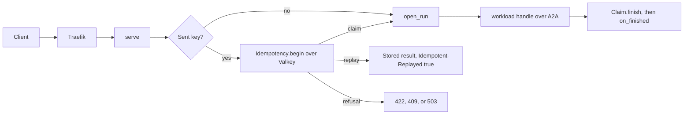

# pocs/poc-04-stateless-scalable

Context for this iteration. The root `CLAUDE.md` and `pocs/CLAUDE.md` still apply. Status: done on 2026-10-08, with criterion 4 flagged. `README.md` holds the evidence. ADR-004 is Accepted (2026-10-08).

## Read first

`docs/planning/poc/004-PoC-4-stateless-scalable.md` (question, exit criteria), then `docs/plans/2026-10-01-poc-04-stateless-scalable.md` (every decision; the code wins where they differ), then `docs/guides/poc-04-how-it-works.md` (the diagrams), then `README.md` here.

## What is here

- `tests/`: one scenario file per exit criterion, the docstring names it. `poc04_harness.py` builds two replicas on Unix sockets sharing one `InMemoryState` and one `InMemoryBus`. Offline: `test_swap_drill.py` (1), `test_idempotency_replicas.py` (2), `test_killed_replica.py` (3), `test_load_results.py` (4, 11; reads `notes/load/results.json`), `test_read_only_compose.py`, `test_read_only_kind.py` (5), `test_graceful_shutdown.py`, `test_workload_drain.py` (6), `test_config_reload.py` with `fixtures/bad-configs/` (7), `test_hidden_state.py` (8), `test_liveness.py` (9), `test_timeout_budget_per_engine.py` (timeout and budget in all four engines). `network`: `test_idempotency_valkey.py`, `test_config_minio.py`; `stack` (`POC04_STACK=1`): `test_compose_scale.py`; kind (`POC04_KIND=1`): `test_kind.py` (9).
- `load/`: `locustfile.py`, `run_matrix.py` (`make load-test`), `run_quiet.sh` (the quiet pass), `run_passes.sh` and `median.py` (the earlier three passes), `idem_cost.py` (keyed against unkeyed, back to back), `steady_client.py`, `kill_drill.py`, `reload_drill.py` (the config drill, exits 1 on a failure); see `load/README.md`.
- `notes/`: `2026-10-01-drills.md` (Compose drills), `2026-10-01-load-results.md`, `2026-10-01-container-roles.md` (kind), `2026-10-01-dapr-vs-broker.md`, `2026-10-01-hidden-state.md`, `2026-10-01-debt.md` (open items and owners), `backlog-changes.md`; `drills/`, `dapr/`, `load/` (scripts, `results.json`, raw files). `demo/`: `demo.sh` (kill, drain, reload on two pairs) and its record `2026-10-01-demo-scale.md`.

## The request path, with idempotency

Client → Traefik (`127.0.0.1:18080`, only to a chassis with `/ready` 200) → `chassis-N` → `serve` (`to_request`, `enforce_limits`) → with a sent key, `Idempotency.begin` over `StatePort` (Valkey) → refusal (422, 409, 503), replay (`Idempotent-Replayed: true`, no run), or claim → `open_run` → `SidecarConnector` → A2A on `127.0.0.1:9000` → `workload-N` `handle` → the model proxy on `127.0.0.1:8090` → the fake model server → events back → `Claim.finish` caches an `end` → `on_finished` publishes a result event when on. Start in `chassis/server/interfaces/serve.py`.

## How to run

- Gate: `make test-poc POC=04` (offline, inside `make test`). Integration: `make test-integration` (Docker). Compose drills: `deploy/compose/scale.sh up <engine> <pairs>`, then `load/kill_drill.py`, or `POC04_STACK=1` with `test_compose_scale.py`. Load: `make load-test ARGS="--dry-run"` first. kind: `make kind-poc04 ARGS="up native-sidecar"`.
- The Docker VM is shared: pass `-p poc04` (scale.sh does), never prune, never stop another project's container. One stack at a time.

## Done means and do not touch

- Done: every exit criterion in `README.md` has evidence (a test name or a command and its output), `make test-poc POC=04` is green, `demo/` holds the run, `notes/backlog-changes.md` exists, and contract v3 and ADR-004 are written.
- Do not touch: the scope of another iteration; `README.md` boxes without evidence; `docs/contracts/` and `docs/planning/` outside the close. Code that outlives the iteration goes in `packages/` or `deploy/`, not here. Ask: `chassis-architect` before a contract change, `platform-security` before keys, egress, or images, `observability-expert` for spans and counters.
